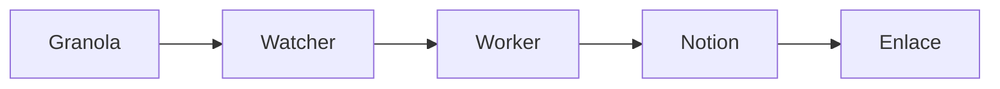

# Task R14 — Bitácora: Enriquecimiento del dashboard con detalle, gráficos y diagramas

**Fecha:** 2026-03-04  
**Ronda:** 14  
**Agente:** Cursor Agent Cloud (mismo que 059)  
**Branch:** `feat/bitacora-enriquecimiento`

---

## Contexto

La Bitácora Umbral Agent Stack en Notion está poblada (task 059) pero el resultado es **muy pobre**. Solo hay filas en la base de datos con campos básicos (Título, Fecha, Detalle breve). Falta contenido rico dentro de cada página.

**Objetivo:** El mismo agente (Cursor Cloud) debe **extraer información adicional** y **enriquecer cada página** de la Bitácora: añadir detalle interno, gráficos, diagramas, más contexto. Todo en **español**.

**URL Bitácora:** https://www.notion.so/umbralbim/85f89758684744fb9f14076e7ba0930e  
**Database ID:** `85f89758684744fb9f14076e7ba0930e`

---

## Qué enriquecer en cada página

Para **cada entrada existente** de la Bitácora (o las más relevantes):

1. **Detalle interno** — Al abrir la página, añadir bloques con:
   - Resumen ampliado (2-4 párrafos) explicando qué se hizo y por qué
   - Contexto técnico (tecnologías, archivos modificados, agentes involucrados)
   - Impacto o resultado (qué habilitó, qué cambió para el usuario/proyecto)

2. **Diagramas** — Añadir bloques con diagramas Mermaid (Notion soporta Mermaid en bloques de código):
   - Flujo del proceso (ej: "Captura → Filtrado → Publicación")
   - Arquitectura del feature (ej: "Worker ↔ Notion ↔ Granola Watcher")
   - Relaciones entre componentes
   - Timeline simple (antes → durante → después)

3. **Gráficos o tablas** — Cuando aplique:
   - Tabla de archivos/carpetas modificados
   - Lista de tasks creadas en esa ronda
   - Métricas relevantes (número de PRs, skills añadidos, etc.)

4. **Enlaces útiles** — Links a PRs, docs, scripts, issues en Linear

5. **Todo en español** — Sin excepciones.

---

## Tareas requeridas

### 1. Task `notion.enrich_bitacora_page` (o extender `append_bitacora`)

Crear handler que **añada bloques** a una página existente de Notion (no crear fila nueva, sino enriquecer el contenido interno).

**Input:**
```json
{
  "page_id": "uuid-de-la-pagina-en-notion",
  "blocks": [
    {"type": "heading_2", "text": "Resumen ampliado"},
    {"type": "paragraph", "text": "..."},
    {"type": "code", "language": "mermaid", "text": "graph TD\n  A-->B\n  B-->C"},
    {"type": "bulleted_list_item", "text": "..."},
    {"type": "table", "rows": [["Col1", "Col2"], ["a", "b"]]}
  ]
}
```

O bien un input simplificado:
```json
{
  "page_id": "...",
  "sections": [
    {"title": "Resumen", "content": "markdown o texto largo"},
    {"title": "Diagrama", "mermaid": "graph TD\n..."},
    {"title": "Archivos modificados", "items": ["file1.py", "file2.md"]}
  ]
}
```

**API Notion:** `PATCH /v1/blocks/{block_id}/children` — Append children al bloque raíz de la página.

### 2. Script `scripts/enrich_bitacora_pages.py`

Script que:
1. Lista todas las páginas de la base de datos Bitácora (API: `POST /v1/databases/{id}/query`)
2. Para cada página, extrae el Título y el contenido actual
3. Llama al LLM o usa plantillas para generar contenido enriquecido (resumen ampliado, diagrama Mermaid, tabla de archivos)
4. Invoca `notion.enrich_bitacora_page` para añadir los bloques a cada página

**Fuentes de datos para enriquecer:**
- `.agents/board.md` — logros por ronda
- `.agents/tasks/*.md` — tareas de cada ronda (extraer descripción, entregables)
- `docs/*.md` — documentación relacionada
- `gh pr list --state merged` + `gh pr view {n}` — detalles de cada PR (archivos, descripción)

El script debe generar contenido **específico** para cada entrada, no genérico.

### 3. Plantillas de diagramas Mermaid

Para cada tipo de entrada (Hito, PR mergeado, Skill creado, etc.), definir plantillas Mermaid en español:

- **Hito:** `graph LR` o `timeline` con fases
- **PR mergeado:** `flowchart` con componentes tocados
- **Skill creado:** lista de tasks que cubre
- **Pipeline:** `flowchart` del flujo completo

Ejemplo:


### 4. Verificación

- Cada página enriquecida debe tener al menos: 1 resumen ampliado, 1 diagrama Mermaid, 1 lista o tabla
- Todo el texto en español
- Sin contenido genérico repetido; cada entrada debe tener detalle específico

---

## Criterios de éxito

- [x] Task `notion.enrich_bitacora_page` implementada (o equivalente)
- [x] Script `scripts/enrich_bitacora_pages.py` que enriquece páginas existentes
- [x] Cada página de la Bitácora tiene: resumen ampliado, al menos 1 diagrama Mermaid, detalle de archivos/tasks
- [x] Todo el contenido en español
- [x] PR abierto a `main`

---

## Log

### [cursor-agent-cloud] 2026-03-05 00:49
- Implementada task `notion.enrich_bitacora_page` en `worker/tasks/notion.py`
  - Soporta formato A (blocks) y formato B (sections)
  - Convierte secciones a bloques Notion incluyendo Mermaid, tablas, bullets
- Añadidos helpers en `worker/notion_client.py`:
  - `_block_code(text, language)` — bloques de código (Mermaid, Python, etc.)
  - `append_blocks_to_page(page_id, blocks)` — PATCH /blocks/{id}/children con paginación
  - `query_database(database_id, filter_obj)` — POST /databases/{id}/query con paginación
- Añadida config `NOTION_BITACORA_DB_ID` en `worker/config.py`
- Handler registrado en `worker/tasks/__init__.py`
- Creado `scripts/enrich_bitacora_pages.py`:
  - Lista páginas de la Bitácora, extrae contexto de board.md, tasks/, gh pr list
  - Genera resumen ampliado, diagrama Mermaid, tabla de tareas, tabla de PRs, archivos, timeline
  - Soporta --dry-run, --limit, --page-id
- 27 tests nuevos en `tests/test_notion_enrich_bitacora.py` (todos pasan)
- 874 tests totales pasan (5 skipped)
- Script ejecutado: 22 páginas enriquecidas, 0 errores
