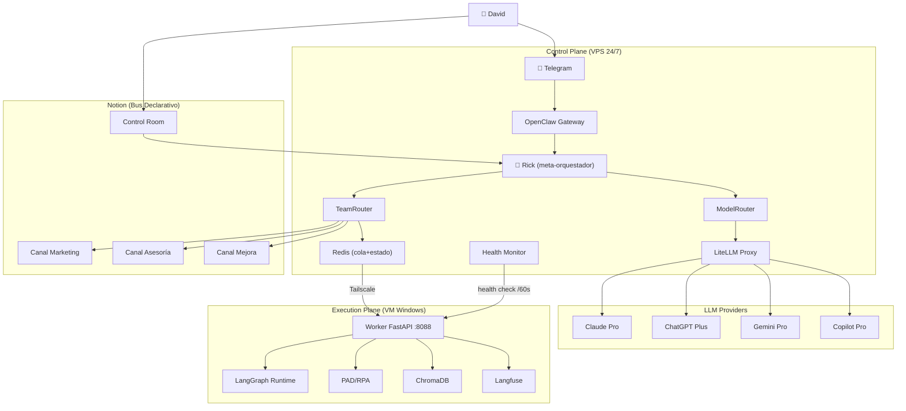

# 01 — Arquitectura v2.8 (Objetivo)

## Evolución

| Versión | Fecha | Cambio |
|---------|-------|--------|
| v2.3 | 2026-02-26 | Plan original: gateway + worker + LangGraph/LiteLLM (scaffolding) |
| v2.8 | 2026-02-27 | Arquitectura multi-agente con equipos, multi-modelo, TaskEnvelope |

## Split: Control Plane vs Execution Plane

| Aspecto | Control Plane (VPS) | Execution Plane (VM) |
|---------|--------------------|--------------------|
| **Disponibilidad** | 24/7 | Cuando VM está encendida |
| **Responsabilidad** | Routing, dispatch, coordinación | Ejecución pesada, herramientas |
| **Componentes** | OpenClaw, Dispatcher, LiteLLM, Redis | LangGraph, Worker, PAD, ChromaDB |
| **RAM** | ~2GB (ligero) | ~8-16GB (pesado) |
| **Conectividad** | Internet + Tailscale | Solo Tailscale |

## Diagrama de Arquitectura Objetivo



## Flujo de una Tarea

```
1. David envía instrucción (Telegram o Notion)
2. Rick clasifica: {team, task_type}
3. ModelRouter selecciona LLM (según task_type + cuota disponible)
4. TeamRouter despacha al equipo correcto
5. Tarea se encola en Redis como TaskEnvelope
6. Worker (VM) desencola y ejecuta via LangGraph
7. Resultado → Redis (estado) + Notion (auditoría) + Langfuse (tracing)
8. Rick reporta a David
```

## Capas del Sistema

| Capa | Componentes | Ubicación |
|------|-----------|-----------|
| **Interfaz** | Telegram, Notion | Cloud |
| **Orquestación** | Rick, ModelRouter, TeamRouter | VPS |
| **Infraestructura** | Redis, LiteLLM, Health Monitor | VPS |
| **Ejecución** | Worker, LangGraph, PAD | VM |
| **Observabilidad** | Langfuse, Notion audit | VM + Notion |
| **Almacenamiento** | ChromaDB (vectores), Redis (estado) | VM + VPS |

## ADRs Relacionados

- [ADR-001: Ubicación de Rick](adr/ADR-001-rick-location.md)
- [ADR-002: Notion vs Queue](adr/ADR-002-notion-vs-queue.md)
- [ADR-003: Modo Degradado](adr/ADR-003-degraded-mode.md)
- [ADR-004: Política de Cuotas](adr/ADR-004-model-quota-policy.md)
