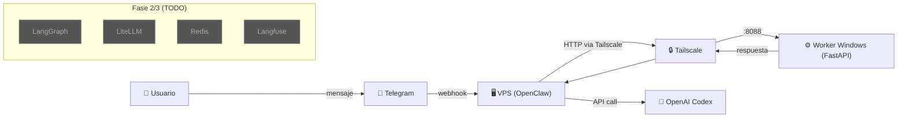

# 01 — Arquitectura v2.3

## Plan Original (v2.3)

La arquitectura v2.3 planificaba un stack completo de agentes con:

1. **Gateway centralizado** (VPS) como punto de entrada para Telegram y otras interfaces.
2. **Orquestador de agentes** (LangGraph) para definir flujos de trabajo como grafos.
3. **Proxy LLM** (LiteLLM) para unificar acceso a múltiples providers (OpenAI, Anthropic, etc).
4. **Cache/State** (Redis) para persistencia de estado de los grafos.
5. **Observabilidad** (Langfuse) para tracing y analytics de LLM calls.
6. **Worker(s)** para ejecución de tareas pesadas o que requieren acceso a recursos locales.

## Variaciones Ejecutadas (Realidad vs Plan)

### ✅ Tailscale como pilar central

El plan original no especificaba Tailscale explícitamente como paso central de conectividad. En la implementación real, Tailscale se convirtió en el mecanismo principal para conectar VPS ↔ Windows de forma segura, sin exponer puertos públicos.

### ✅ Worker HTTP (FastAPI) como puente VM→VPS

En lugar de implementar directamente LangGraph/LiteLLM, se creó un **Worker HTTP mínimo** con FastAPI como paso intermedio. Este worker permite:
- Health checks desde el VPS
- Ejecución de tareas básicas (`ping`)
- Base extensible para agregar handlers más complejos

### ✅ OpenAI Codex como LLM default

Se priorizó `openai-codex/gpt-5.3-codex` como provider principal. Anthropic quedó configurado pero como **opcional/fallback** dado que su integración requiere pasos adicionales y presenta riesgos de disponibilidad.

### ✅ Telegram centralizado en VPS

En Windows se **deshabilitó** Telegram local para evitar conflictos de doble instancia (error 409 `getUpdates`). Telegram opera exclusivamente desde el VPS.

### ⚠️ Antigravity (decisión del usuario)

Antigravity se mantiene activo por decisión explícita del usuario. Se documenta como riesgo conocido dado que:
- Puede consumir recursos adicionales
- Requiere monitoreo propio
- El usuario acepta este trade-off conscientemente

## Diagrama de Arquitectura

> Fuente: [`infra/diagrams/architecture.mmd`](../infra/diagrams/architecture.mmd)

## Capas de la Arquitectura

| Capa | Componente | Ubicación | Estado |
|------|-----------|-----------|--------|
| **Interfaz** | Telegram Bot | VPS | ✅ |
| **Gateway** | OpenClaw | VPS (systemd) | ✅ |
| **Red** | Tailscale | VPS + Windows | ✅ |
| **Worker** | FastAPI + Uvicorn | Windows (NSSM) | ✅ |
| **LLM** | OpenAI Codex 5.3 | Cloud (API) | ✅ |
| **Orquestación** | LangGraph | VPS (Docker) | 📋 |
| **Proxy LLM** | LiteLLM | VPS (Docker) | 📋 |
| **Cache** | Redis | VPS (Docker) | 📋 |
| **Observabilidad** | Langfuse | VM (Docker) | 📋 |
| **Vector Store** | ChromaDB | VM (Docker) | 📋 |
