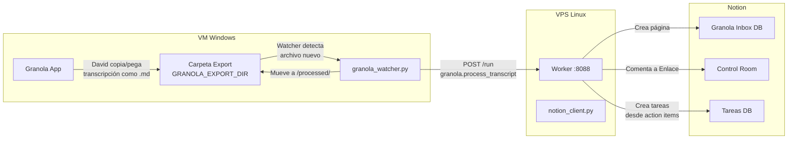

# 50 — Granola → Notion Pipeline

> Transcripciones de reunión desde Granola hacia Notion con follow-up proactivo de Rick.

## 1. Investigación: Granola plan básico

### 1a. Capacidades del plan básico (Free/Basic)

| Característica | Disponibilidad | Detalle |
|---|---|---|
| Export automático a carpeta local | **No** | Granola no escribe archivos locales automáticamente |
| Formato de export | CSV (bulk, >30 días, sin transcripciones completas) | Solo resúmenes y títulos |
| Webhook / API | **No** en plan básico | Enterprise API solo en plan Business ($14/user/mes) |
| Export a Google Drive | **No** nativo | No hay integración directa |
| MCP (Model Context Protocol) | **Sí** (OAuth, browser-based) | 4 tools: `query_granola_meetings`, `list_meetings`, `get_meetings`, `get_meeting_transcript` (transcripción completa solo en planes pagos) |
| Metadata en notas | Título, fecha, participantes, duración | Sin diarización por speaker en desktop |
| Action items | No como campo estructurado | Se extraen del markdown de las notas (headings, bullets) |
| Cache local (Windows) | `%APPDATA%\Granola\cache-v3.json` | **Transcripciones removidas del cache desde Feb 2026**; solo metadata |
| Copiar transcript individual | **Sí** | Desde la UI, botón Copy en el panel de transcripción |

### 1b. Herramientas de terceros relevantes

- **granola-to-markdown** (GitHub: mikedemarais): exporta notas a archivos `.md` desde el cache local — **deprecado** para transcripciones (solo metadata desde Feb 2026).
- **granola-cli** (GitHub: joelhooks): CLI con MCP para acceso a notas — requiere OAuth.
- **Granola-to-NotePlan** (GitHub: dannymcc): sync de notas a NotePlan vía cache.

### 1c. Conclusión

El plan básico de Granola **no ofrece** export automático, webhook ni API programática. La transcripción completa solo es accesible copiándola manualmente desde la UI de Granola. El MCP está disponible pero requiere OAuth browser-based (no API key), lo que dificulta la automatización server-side.

## 2. Arquitecturas evaluadas

| Opción | Descripción | Pros | Contras | Viabilidad |
|---|---|---|---|---|
| **A** | VM file watcher → `windows.fs.read_text` → Notion | Sin deps externas, usa infra existente | Requiere export manual de Granola + polling | Alta |
| **B** | Export a Google Drive → Google Drive API → Notion | Google Drive como buffer | Necesita Google Drive API, Granola no exporta a GDrive | Baja |
| **C** | Granola webhook → Dispatcher → Worker → Notion | Más elegante | Granola básico no tiene webhook | Nula |
| **D** | Script en VM monitorea carpeta → POST al Worker → Notion | Automático, desacoplado | Requiere script siempre corriendo + export manual inicial | **Alta** |

### Arquitectura recomendada: Opción D (con fallback manual vía A)

**Justificación**: David exporta/copia la transcripción desde Granola a una carpeta designada (`GRANOLA_EXPORT_DIR`). Un watcher en la VM detecta archivos `.md` nuevos y los envía al Worker para procesamiento. El Worker crea la página en Notion, notifica a Enlace y extrae action items.

Si el watcher no está corriendo, Rick puede usar la **opción A** como fallback: leer archivos con `windows.fs.read_text` y llamar a `granola.process_transcript` directamente.

## 3. Diagrama de arquitectura



## 4. Flujo completo

1. **David** termina una reunión en Granola.
2. **David** copia la transcripción desde la UI de Granola y la pega en un archivo `.md` en `GRANOLA_EXPORT_DIR` (o usa "Share > Copy" y la guarda).
3. **granola_watcher.py** (corriendo en la VM) detecta el archivo nuevo.
4. El watcher parsea el markdown, extrae metadata (título de `# heading`, fecha del nombre de archivo o contenido, action items de listas con keywords).
5. El watcher envía `POST /run` con task `granola.process_transcript` al Worker.
6. **Worker** ejecuta el handler:
   - Crea página en la Granola Inbox DB de Notion.
   - Agrega comentario en la página: "Transcripción lista para optimizar".
   - Extrae action items y crea tareas en Notion vía `notion.upsert_task`.
7. El watcher mueve el archivo a `GRANOLA_EXPORT_DIR/processed/`.
8. **Rick** puede generar follow-ups proactivos con `granola.create_followup`.

## 5. Setup del watcher en la VM

### Requisitos

- Python 3.10+ instalado en la VM Windows.
- Acceso HTTP al Worker (mismo host o vía Tailscale).

### Variables de entorno

```
GRANOLA_EXPORT_DIR=C:\Users\rick\Documents\Granola
GRANOLA_PROCESSED_DIR=C:\Users\rick\Documents\Granola\processed
WORKER_URL=http://localhost:8088
WORKER_TOKEN=<token>
```

### Ejecución

```powershell
# Ejecución directa
python scripts\vm\granola_watcher.py

# Como servicio con NSSM
nssm install GranolaWatcher "C:\Python312\python.exe" "C:\umbral-agent-stack\scripts\vm\granola_watcher.py"
nssm set GranolaWatcher AppDirectory "C:\umbral-agent-stack"
nssm set GranolaWatcher AppEnvironmentExtra "GRANOLA_EXPORT_DIR=C:\Users\rick\Documents\Granola" "WORKER_URL=http://localhost:8088" "WORKER_TOKEN=<token>"
nssm start GranolaWatcher
```

## 6. Variables de entorno

| Variable | Requerida | Dónde | Descripción |
|---|---|---|---|
| `GRANOLA_EXPORT_DIR` | Sí (watcher) | VM | Carpeta donde David guarda los exports de Granola |
| `GRANOLA_PROCESSED_DIR` | No | VM | Subcarpeta para archivos procesados (default: `EXPORT_DIR/processed`) |
| `WORKER_URL` | Sí (watcher) | VM | URL del Worker HTTP |
| `WORKER_TOKEN` | Sí (watcher) | VM | Token Bearer para autenticación |
| `NOTION_GRANOLA_DB_ID` | Sí (handler) | Worker | ID de la DB Granola Inbox en Notion |
| `NOTION_API_KEY` | Sí (handler) | Worker | Token de integración de Notion |
| `ENLACE_NOTION_USER_ID` | No | Worker | ID de usuario de Enlace para mentions (si se implementa) |

## 7. Handlers del Worker

### `granola.process_transcript`

Recibe transcripción parseada y la sube a Notion con action items.

### `granola.create_followup`

Rick usa este handler proactivamente para crear follow-ups: recordatorios en Notion, borradores de email, o propuestas.

Ver detalles en `worker/tasks/granola.py`.
