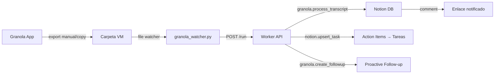

# 50 — Granola → Notion Pipeline

> Arquitectura e implementación del pipeline de transcripciones Granola → Notion con follow-up proactivo de Rick.

## 1. Investigación: Granola plan básico

### 1a. Capacidades del plan Free/Basic

| Aspecto | Estado |
|---------|--------|
| Export automático a carpeta local | No nativo. La app almacena en cache local (`cache-v3.json`) pero desde ~Feb 2026 los transcripts se guardan solo server-side |
| Formato de export | CSV manual (Settings > Profile > Generate CSV) — solo títulos y resúmenes, sin transcripts completos |
| Webhook / API | No disponible en plan básico. API solo en Enterprise ($35+/usuario/mes) |
| Export a Google Drive | No nativo. Requiere herramienta de terceros o script manual |
| Metadata incluida | Título de reunión, fecha, participantes (del calendario), notas del usuario. Los action items son parte del texto de notas |
| MCP (Model Context Protocol) | Disponible en planes superiores, no en básico |
| Bulk transcript export | No disponible en ningún plan actual |

### 1b. Acceso a datos locales

Granola almacena un cache local:
- **macOS**: `~/Library/Application Support/Granola/cache-v3.json`
- **Windows**: `%APPDATA%\Granola\cache-v3.json` (probable)

Herramientas comunitarias como `granola-to-markdown` leen este cache para exportar a Markdown. Sin embargo, desde Feb 2026 los transcripts completos ya no están en el cache local — solo metadata (títulos, fechas, participantes).

### 1c. Workaround viable

El usuario puede exportar manualmente notas individuales desde la app Granola:
1. Abrir una reunión en Granola
2. Copiar el contenido (Ctrl+A, Ctrl+C) — incluye notas formateadas en Markdown
3. Pegar en un archivo `.md` en una carpeta monitoreada

Alternativamente, se puede usar el shortcut de Granola "Share > Copy to clipboard" que genera Markdown limpio.

## 2. Arquitecturas evaluadas



| Opción | Descripción | Pros | Contras | Veredicto |
|--------|-------------|------|---------|-----------|
| **A** | VM watcher detecta `.md` nuevo → Worker → Notion | Sin dependencias externas; usa infra existente | Requiere que David pegue/exporte manualmente a carpeta | **RECOMENDADA** |
| B | VM exporta a Google Drive → API detecta → Notion | Google Drive como buffer | Necesita Google Drive API + OAuth; complejidad innecesaria | Descartada |
| C | Granola webhook → Dispatcher → Worker → Notion | Más elegante, automático | Granola NO tiene webhooks en plan básico | Imposible |
| D | Script lee cache-v3.json periódicamente | Totalmente automático | Cache ya no tiene transcripts completos (Feb 2026) | Inviable |

### Arquitectura recomendada: Opción A — VM File Watcher

**Justificación:**
1. David ya tiene el Worker corriendo en la VM (puerto 8088)
2. Rick ya puede leer/escribir archivos en la VM con `windows.fs.*`
3. No requiere APIs adicionales ni autenticación extra
4. El watcher se integra naturalmente con el stack existente
5. Google Drive montado en `G:\Mi unidad\` podría usarse como carpeta alternativa

**Flujo completo:**

1. David termina una reunión en Granola
2. David copia las notas (Share > Copy to clipboard) y las pega en un `.md` en la carpeta monitoreada
3. `granola_watcher.py` detecta el archivo nuevo
4. El watcher parsea el Markdown: extrae título, fecha, participantes, action items
5. Envía `POST /run` con task `granola.process_transcript` al Worker
6. El Worker crea la página en Notion (Granola Inbox DB) con formato rico
7. Agrega comentario en la página: "Transcripción lista para optimizar"
8. Extrae action items y crea tareas individuales en Notion (Kanban DB)
9. Rick puede usar `granola.create_followup` para generar propuestas, borradores de email, o recordatorios

## 3. Componentes implementados

### 3a. `scripts/vm/granola_watcher.py`

Script Python que corre en la VM Windows. Monitorea una carpeta con `watchdog` (file system events) y fallback a polling.

- Detecta archivos `.md` nuevos
- Parsea metadata del Markdown (título, fecha, participantes, action items)
- Llama al Worker: `POST /run` con task `granola.process_transcript`
- Mueve archivos procesados a subcarpeta `processed/`
- Log a `granola_watcher.log`

### 3b. `worker/tasks/granola.py`

Dos handlers:

| Handler | Descripción |
|---------|-------------|
| `granola.process_transcript` | Recibe transcript parseado → crea página Notion con markdown → notifica a Enlace → crea tareas por action item |
| `granola.create_followup` | Rick usa proactivamente: reminder (tarea Notion con deadline), proposal (genera resumen estructurado en Notion), email_draft (borrador de seguimiento en Notion) |

### 3c. Skill: `granola-pipeline/SKILL.md`

Enseña a Rick cuándo y cómo usar el pipeline:
- Triggers: "reunión terminada", "subir transcripción", "procesar granola", "compromisos reunión"
- Procedimientos: cómo activar cada handler
- Proactividad: revisar transcripciones sin follow-up

## 4. Variables de entorno

| Variable | Descripción | Requerida |
|----------|-------------|-----------|
| `GRANOLA_EXPORT_DIR` | Carpeta de exports en VM (default: `C:\Users\rick\Documents\Granola`) | Watcher |
| `GRANOLA_PROCESSED_DIR` | Carpeta de archivos procesados (default: `{EXPORT_DIR}\processed`) | Watcher |
| `NOTION_GRANOLA_DB_ID` | ID de la DB de transcripciones en Notion | Worker |
| `ENLACE_NOTION_USER_ID` | ID de usuario Enlace en Notion (para menciones) | Opcional |
| `WORKER_URL` | URL del Worker API | Watcher |
| `WORKER_TOKEN` | Token de autenticación del Worker | Watcher |

## 5. Setup del watcher en VM

```powershell
# 1. Instalar dependencias
pip install watchdog httpx

# 2. Configurar variables de entorno
$env:GRANOLA_EXPORT_DIR = "C:\Users\rick\Documents\Granola"
$env:WORKER_URL = "http://localhost:8088"
$env:WORKER_TOKEN = "<token>"

# 3. Crear carpeta si no existe
New-Item -ItemType Directory -Force -Path $env:GRANOLA_EXPORT_DIR
New-Item -ItemType Directory -Force -Path "$env:GRANOLA_EXPORT_DIR\processed"

# 4. Ejecutar
python scripts/vm/granola_watcher.py
```

Para ejecución persistente, registrar como servicio NSSM o tarea programada de Windows.

## 6. Uso desde Rick

### Procesar transcript manualmente
```json
POST /run
{
  "task": "granola.process_transcript",
  "input": {
    "title": "Reunión con Cliente ABC",
    "content": "# Notas\n\n## Participantes\n- David\n- Juan\n\n## Resumen\n...\n\n## Action Items\n- [ ] Enviar propuesta\n- [ ] Agendar siguiente reunión",
    "date": "2026-03-04",
    "attendees": ["David", "Juan"],
    "action_items": ["Enviar propuesta", "Agendar siguiente reunión"]
  }
}
```

### Crear follow-up proactivo
```json
POST /run
{
  "task": "granola.create_followup",
  "input": {
    "transcript_page_id": "abc123...",
    "followup_type": "reminder",
    "title": "Enviar propuesta a Cliente ABC",
    "due_date": "2026-03-07"
  }
}
```
