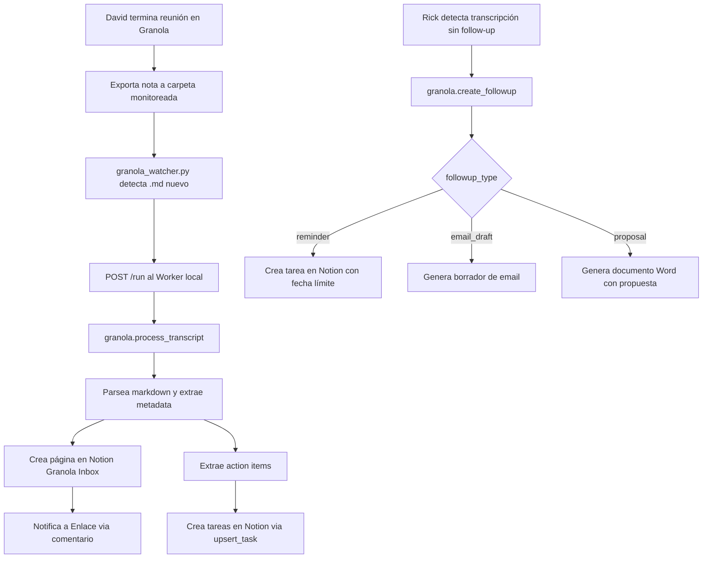

# Granola → Notion Pipeline

> Documento de diseño: pipeline automático para transferir transcripciones de reuniones desde Granola a Notion, con extracción de action items y follow-up proactivo de Rick. **Notion:** se usa la integración de Rick (`NOTION_API_KEY`); solo se configura `NOTION_GRANOLA_DB_ID` como ID de la base de datos destino (no hay integración Notion propia de Granola).

## 1. Investigación de Granola (plan básico)

### 1a. Capacidades del plan básico

| Característica | Disponible | Detalle |
|----------------|-----------|---------|
| Transcripción en tiempo real | Si | Unlimited meetings |
| Export automático a carpeta | No | No existe export automático nativo |
| Export CSV (bulk) | Parcial | Solo notas > 30 días; sin transcripts completos |
| Export individual (copy) | Si | Copiar nota individual en formato Markdown |
| Webhook nativo | No | Solo disponible via Zapier (plan Pro+) |
| API pública | No | Solo plan Enterprise ($35+/user/mes) |
| Export a Google Drive | No | No soportado directamente |
| Almacenamiento local | Si | Cache en `%APPDATA%\Granola\cache-v3.json` (Windows) |
| Zapier integration | Pro+ | No disponible en plan básico |

### 1b. Metadata incluida en exports

Cuando se copia una nota individual, Granola incluye:

- **Título de la reunión** (derivado del evento de calendario)
- **Fecha y hora** de la reunión
- **Participantes/attendees** (si vinculado a calendario)
- **Notas del usuario** (las notas tomadas durante la reunión)
- **Transcripción completa** (audio transcrito)
- **Action items** (extraídos por AI, con asignación sugerida)
- **Resumen AI** (summary generado automáticamente)

### 1c. Acceso local al cache

Herramientas de la comunidad (`granola-to-markdown`, `granola-cli`) demuestran que Granola almacena datos localmente en:

- **macOS**: `~/Library/Application Support/Granola/cache-v3.json`
- **Windows**: `%APPDATA%\Granola\cache-v3.json` (probable)

El cache contiene documentos JSON con toda la metadata de las reuniones. Sin embargo, este formato no está documentado oficialmente y puede cambiar sin aviso.

## 2. Arquitecturas evaluadas

| Opción | Descripción | Pros | Contras |
|--------|-------------|------|---------|
| A — Rick lee VM | VM detecta archivo → Rick lo lee con `windows.fs.read_text` → sube a Notion | Sin dependencias externas | Requiere polling desde VPS; latencia alta |
| B — Google Drive buffer | VM exporta a Google Drive → Rick detecta vía API → sube a Notion | Google Drive como buffer | Necesita Google Drive API; complejidad extra |
| C — Webhook Granola | Granola webhook → Dispatcher → Worker → Notion | Más elegante | No disponible en plan básico |
| **D — Watcher en VM** | **Script en VM monitorea carpeta → POST al Worker local → Notion** | **Automático; latencia baja; sin dependencias** | **Requiere script corriendo en VM** |

### Arquitectura elegida: Opción D — Watcher en VM

**Justificación:**

1. **Simplicidad**: el script corre en la misma VM donde está Granola y el Worker.
2. **Sin dependencias externas**: no requiere Google Drive API, Zapier, ni webhook.
3. **Latencia mínima**: el watcher detecta archivos nuevos y los envía directamente al Worker local.
4. **Robusto**: tolerante a reinicios (marca archivos procesados), sin estado externo.
5. **Compatible con el flujo actual**: David exporta manualmente la nota (Copy → Paste en archivo `.md`) o usa `granola-to-markdown` para batch.

### Flujo operativo

```
David termina reunión en Granola
       │
       ▼
Exporta nota a carpeta monitoreada
(manual copy/paste o granola-to-markdown)
       │
       ▼
┌─────────────────────────────┐
│  granola_watcher.py (VM)    │
│  Monitorea GRANOLA_EXPORT_DIR│
│  Detecta *.md nuevos        │
└──────────┬──────────────────┘
           │ POST /run
           ▼
┌─────────────────────────────┐
│  Worker (VM :8088)          │
│  task: granola.process_     │
│        transcript           │
│  1. Parsea markdown         │
│  2. Extrae metadata         │
│  3. Sube a Notion           │
│  4. Extrae action items     │
│  5. Crea tareas en Notion   │
│  6. Notifica a Enlace       │
└──────────┬──────────────────┘
           │
           ▼
┌─────────────────────────────┐
│  Notion (Granola Inbox DB)  │
│  - Página con transcript    │
│  - Action items como tareas │
│  - Comentario para Enlace   │
└─────────────────────────────┘
```



## 3. Setup del watcher en VM

### Instalación

```powershell
# En la VM Windows, desde el repo clonado:
cd C:\GitHub\umbral-agent-stack

# Instalar dependencias (requests ya incluido en el entorno)
pip install watchdog requests

# Crear carpetas
mkdir C:\Users\rick\Documents\Granola
mkdir C:\Users\rick\Documents\Granola\processed
```

### Variables de entorno en VM

```
GRANOLA_EXPORT_DIR=C:\Users\rick\Documents\Granola
GRANOLA_PROCESSED_DIR=C:\Users\rick\Documents\Granola\processed
WORKER_URL=http://localhost:8088
WORKER_TOKEN=<token del worker>
```

### Ejecución

```powershell
# Modo continuo (watcher con watchdog)
python scripts/vm/granola_watcher.py

# Modo one-shot (procesa archivos pendientes y sale)
python scripts/vm/granola_watcher.py --once
```

### Registro como servicio (NSSM)

```powershell
nssm install granola-watcher "C:\Python312\python.exe" "C:\GitHub\umbral-agent-stack\scripts\vm\granola_watcher.py"
nssm set granola-watcher AppDirectory "C:\GitHub\umbral-agent-stack"
nssm set granola-watcher AppEnvironmentExtra "GRANOLA_EXPORT_DIR=C:\Users\rick\Documents\Granola" "WORKER_URL=http://localhost:8088" "WORKER_TOKEN=<token>"
nssm start granola-watcher
```

## 4. Variables de entorno

| Variable | Dónde | Requerida | Descripción |
|----------|-------|-----------|-------------|
| `GRANOLA_EXPORT_DIR` | VM | Si (watcher) | Carpeta donde se depositan los exports de Granola |
| `GRANOLA_PROCESSED_DIR` | VM | No | Carpeta destino para archivos procesados (default: `{EXPORT_DIR}/processed`) |
| `WORKER_URL` | VM | Si (watcher) | URL del Worker (default: `http://localhost:8088`) |
| `WORKER_TOKEN` | VM + Worker | Si | Token de autenticación del Worker |
| `NOTION_GRANOLA_DB_ID` | Worker | Si | ID de la DB de transcripciones en Notion. Usa la misma integración Rick (`NOTION_API_KEY`). |
| `NOTION_TASKS_DB_ID` | Worker | No | ID de la DB Kanban para action items |
| `ENLACE_NOTION_USER_ID` | Worker | No | ID de usuario de Enlace para @mentions en Notion |

## 5. Handlers del Worker

### `granola.process_transcript`

Recibe una transcripción parseada y ejecuta el pipeline completo:

1. Crea página en Notion (Granola Inbox DB)
2. Extrae action items del contenido
3. Crea tareas individuales en Notion (si `NOTION_TASKS_DB_ID` configurado)
4. Notifica a Enlace con comentario en la página creada

### `granola.create_followup`

Handler proactivo que Rick usa para dar seguimiento:

- `followup_type: "reminder"` → crea tarea en Notion con fecha límite
- `followup_type: "email_draft"` → genera borrador de email (texto estructurado)
- `followup_type: "proposal"` → genera resumen/propuesta formateado

## 6. Formato esperado de archivos Markdown

El watcher espera archivos `.md` con el siguiente formato (compatible con Granola export):

```markdown
# Título de la reunión

**Date:** 2026-03-04
**Attendees:** David, Cliente X, Partner Y

## Notes

Contenido de las notas tomadas durante la reunión...

## Transcript

Transcripción completa del audio...

## Action Items

- [ ] Enviar propuesta a Cliente X (David, 2026-03-07)
- [ ] Revisar presupuesto (Partner Y, 2026-03-10)
- [ ] Agendar siguiente reunión (David)
```

El parser es flexible: si no encuentra las secciones esperadas, trata todo el contenido como transcripción.
