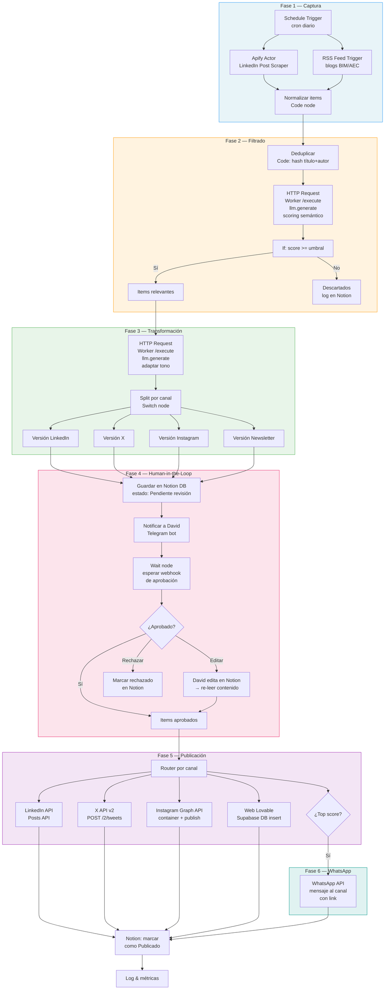
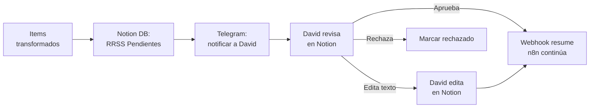
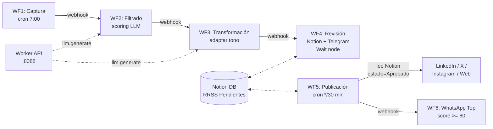

# 60 — Pipeline de Automatización RRSS con n8n

> Diseño del pipeline de captura, filtrado, transformación, revisión humana y publicación multi-canal de contenido para redes sociales de David Moreira.

**Estado:** Diseño (pendiente validación por David)
**Fecha:** 2026-03-04
**Branch:** `feat/rrss-pipeline-n8n`

---

## Índice

1. [Visión general](#1-visión-general)
2. [Diagrama del pipeline](#2-diagrama-del-pipeline)
3. [Fase 1 — Captura de contenido](#3-fase-1--captura-de-contenido)
4. [Fase 2 — Evaluación y filtrado](#4-fase-2--evaluación-y-filtrado)
5. [Fase 3 — Transformación y adaptación de tono](#5-fase-3--transformación-y-adaptación-de-tono)
6. [Fase 4 — Human-in-the-loop](#6-fase-4--human-in-the-loop)
7. [Fase 5 — Publicación multi-canal](#7-fase-5--publicación-multi-canal)
8. [Fase 6 — WhatsApp — selección de "más interesantes"](#8-fase-6--whatsapp--selección-de-más-interesantes)
9. [Arquitectura n8n propuesta](#9-arquitectura-n8n-propuesta)
10. [Comparativa de métodos de captura LinkedIn](#10-comparativa-de-métodos-de-captura-linkedin)
11. [Recomendación human-in-the-loop](#11-recomendación-human-in-the-loop)
12. [APIs, cuentas y credenciales requeridas](#12-apis-cuentas-y-credenciales-requeridas)
13. [Restricciones legales y de ToS](#13-restricciones-legales-y-de-tos)
14. [Riesgos y mitigaciones](#14-riesgos-y-mitigaciones)
15. [Checklist de requisitos previos](#15-checklist-de-requisitos-previos)
16. [Orden de implementación sugerido](#16-orden-de-implementación-sugerido)
17. [Preguntas para David](#17-preguntas-para-david)

---

## 1. Visión general

David quiere automatizar la presencia en redes sociales capturando contenido relevante de LinkedIn (páginas y perfiles que él siga), filtrándolo, adaptándolo a su marca personal y publicándolo en múltiples canales con revisión humana antes de cada publicación.

**Canales de salida:**

| Canal | Tipo de contenido |
|-------|-------------------|
| **LinkedIn** | Post texto largo, carruseles, artículos |
| **Web newsletter (Lovable)** | Artículo/newsletter semanal |
| **X (Twitter)** | Hilo o post corto con enlace |
| **Instagram** | Imagen/carrusel con caption |
| **WhatsApp (canal de difusión)** | Mensaje con link a la pieza más relevante |

**Motor de automatización:** n8n self-hosted en la VPS existente.

**Integración con Umbral Agent Stack:** El Worker (`worker/app.py`) expone endpoints para `llm.generate` y `research.web` que n8n puede invocar vía HTTP Request. La publicación de webhooks existente (`make.post_webhook`) sirve de patrón; se puede extender o crear un handler equivalente para n8n (`n8n.post_webhook`).

---

## 2. Diagrama del pipeline



---

## 3. Fase 1 — Captura de contenido

### Fuentes

| Fuente | Método | Frecuencia |
|--------|--------|------------|
| Perfiles/páginas de LinkedIn (lista configurable) | Apify Actor "LinkedIn Post Scraper" | Diaria (configurable) |
| Blogs BIM/AEC relevantes | RSS Feed Trigger de n8n | Continuo (polling configurable) |
| Hashtags LinkedIn (#BIM, #AEC, #RevitAPI, etc.) | Apify Actor con filtro hashtag | Diaria |

### Output normalizado por item

```json
{
  "source": "linkedin|rss",
  "source_url": "https://linkedin.com/posts/...",
  "author": "Nombre Autor",
  "author_profile_url": "https://...",
  "title": "Título o primeras 100 chars",
  "body": "Contenido completo del post",
  "media_urls": ["https://..."],
  "media_type": "text|image|video|carousel|article",
  "published_at": "2026-03-04T10:00:00Z",
  "engagement": {
    "likes": 42,
    "comments": 7,
    "shares": 3
  },
  "tags": ["BIM", "Revit", "IA"],
  "hash": "sha256_de_titulo_y_autor"
}
```

### Nodos n8n para captura

```
[Schedule Trigger: "0 7 * * *"]
  → [HTTP Request: POST https://api.apify.com/v2/acts/consummate_mandala~linkedin-post-scraper/runs]
     body: { "startUrls": [...], "maxItems": 50 }
  → [Wait: 60s — esperar a que Apify termine]
  → [HTTP Request: GET dataset results]
  → [Code: normalizar a schema]
  → [Merge con RSS items]
```

---

## 4. Fase 2 — Evaluación y filtrado

### Criterios de relevancia

| Criterio | Peso | Descripción |
|----------|------|-------------|
| **Temática BIM/AEC** | 30% | Keywords: BIM, Revit, Dynamo, AEC, coordinación, ISO 19650, constructech |
| **Automatización / IA** | 25% | Keywords: Power Automate, IA, LLM, Copilot, automatización, citizen developer |
| **Datos / métricas reales** | 20% | Presencia de números, porcentajes, resultados medibles |
| **Formato replicable** | 15% | ¿Es un caso real, tutorial o framework que David pueda reinterpretar? |
| **Engagement del original** | 10% | Likes + comentarios del post original como señal de calidad |

### Prompt para scoring (Worker `llm.generate`)

```
Eres un asistente de curación de contenido para David Moreira, consultor BIM+IA+Automatización en el sector AEC (arquitectura, ingeniería, construcción).

Evalúa el siguiente contenido de LinkedIn y asigna un score de 0 a 100 según estos criterios:
- Relevancia temática para audiencia BIM/AEC (30%)
- Relación con automatización/IA aplicada (25%)
- Presencia de datos o métricas reales (20%)
- Potencial para reinterpretación como contenido propio (15%)
- Engagement del post original (10%)

Responde SOLO con JSON:
{
  "score": <número 0-100>,
  "reason": "<una oración explicando>",
  "topics": ["<topic1>", "<topic2>"],
  "reusable_angle": "<cómo David podría reinterpretar esto>"
}

Contenido a evaluar:
---
Autor: {{author}}
Fecha: {{published_at}}
Texto: {{body}}
Engagement: {{engagement.likes}} likes, {{engagement.comments}} comentarios
---
```

### Nodos n8n para filtrado

```
[Items normalizados]
  → [Code: deduplicar por hash — comparar con Redis set "rrss:seen_hashes"]
  → [Split In Batches: 5 items por lote — respetar rate limits LLM]
  → [HTTP Request: POST Worker /execute
       task_type: "llm.generate"
       input.prompt: <prompt scoring>
       input.model: "gemini-2.5-flash"]
  → [Code: parsear JSON respuesta, extraer score]
  → [If: score >= 60]
     → Sí: continuar a Transformación
     → No: [Notion: log de item descartado con razón]
```

### Umbral recomendado

- **score >= 60:** Pasa a transformación
- **score >= 80:** Candidato a "más interesante" para WhatsApp (Fase 6)

---

## 5. Fase 3 — Transformación y adaptación de tono

### Restricciones por plataforma

| Plataforma | Límite texto | Formato | Hashtags | Notas |
|------------|-------------|---------|----------|-------|
| **LinkedIn** | ~3000 chars (post), sin límite (artículo) | Párrafos cortos, saltos de línea, sin links en body | 0-3 máx (no suman en 2025+) | Links en primer comentario |
| **X (Twitter)** | 280 chars (free) / 25000 (Premium) | Hilos si >280 chars | 1-2 relevantes | Enlace acorta a 23 chars |
| **Instagram** | 2200 chars caption | Imagen/carrusel obligatorio | 5-10 en caption | No links clicables en caption; link en bio |
| **Newsletter web** | Sin límite | HTML, Markdown | N/A | Estructura: caso + herramienta + recurso |

### Prompt para adaptación de tono (Worker `llm.generate`)

```
Eres el ghostwriter de David Moreira, consultor BIM+IA+Automatización en AEC.

REGLAS DE TONO (marca personal de David):
- Con datos: toda afirmación tiene un número o caso detrás
- Directo: no hay intro innecesaria, ir al grano
- Sin slop: prohibido "transformación digital", "ecosistema", "sinergia", "potenciar"
- Primera persona real: "En OXXO Chile hice X" > "Las empresas deben hacer X"
- Sin conclusión genérica: no terminar con "espero que les sirva"
- Las primeras 2 líneas deben funcionar como gancho (LinkedIn trunca a 210 chars)
- No poner links en el cuerpo del post de LinkedIn (van en primer comentario)
- Máximo 3 hashtags en LinkedIn
- No usar engagement bait: "Comparte si...", "Etiqueta a alguien..."

CONTENIDO FUENTE:
{{body}}

ÁNGULO SUGERIDO:
{{reusable_angle}}

Genera versiones adaptadas para cada canal:

1. **linkedin_post**: Post de LinkedIn (800-1500 chars), con hook fuerte en primeras 2 líneas.
2. **x_post**: Tweet o hilo (máx 280 chars por tweet, máx 3 tweets).
3. **instagram_caption**: Caption de Instagram (máx 2200 chars), terminando con CTA.
4. **newsletter_section**: Sección de newsletter (200-400 palabras), formato: contexto + insight + aplicación práctica.

Responde en JSON con estas 4 keys. Cada valor es string.
```

### Nodos n8n para transformación

```
[Items que pasaron filtro]
  → [HTTP Request: POST Worker /execute
       task_type: "llm.generate"
       input.prompt: <prompt adaptación>
       input.model: "gemini-2.5-flash"]
  → [Code: parsear JSON, crear 4 items por cada input — uno por canal]
  → [Set: agregar campo "canal" a cada item]
```

---

## 6. Fase 4 — Human-in-the-loop

### Flujo de revisión



### Base de datos Notion "RRSS Pendientes"

| Propiedad | Tipo | Valores |
|-----------|------|---------|
| `Título` | Title | Título/hook del post |
| `Canal` | Select | LinkedIn, X, Instagram, Newsletter, WhatsApp |
| `Contenido` | Rich text | Texto completo del post adaptado |
| `Contenido original` | Rich text | Post fuente (referencia) |
| `Score` | Number | Score de relevancia (0-100) |
| `Estado` | Select | Pendiente / Aprobado / Editado / Rechazado / Publicado |
| `URL fuente` | URL | Link al post original |
| `Fecha propuesta` | Date | Fecha sugerida de publicación |
| `Notas David` | Rich text | Comentarios de David |

### Implementación en n8n

```
[Items transformados — uno por canal]
  → [Notion: crear página en DB "RRSS Pendientes"
       estado: "Pendiente"]
  → [Telegram: enviar mensaje a David
       "🔔 Hay N posts pendientes de revisión en RRSS.
        Revisar: <link a vista Notion filtrada por Pendiente>"]
  → [Wait node: Resume on webhook
       timeout: 48h
       URL de resume almacenada en la página Notion como propiedad oculta]
```

**Opción de aprobación rápida vía Telegram:**

```
[Telegram: enviar mensaje con botones inline]
  "📝 LinkedIn: <título>
   Score: 85/100
   [✅ Aprobar] [✏️ Editar en Notion] [❌ Rechazar]"
```

Cada botón envía un webhook con el `execution_id` y la decisión. El Wait node se resume automáticamente.

### Revisión batch

David puede usar una vista Kanban en Notion con columnas: Pendiente → Aprobado → Publicado → Rechazado. Un segundo workflow n8n (cron cada 30 min) lee los items marcados "Aprobado" y dispara la publicación.

---

## 7. Fase 5 — Publicación multi-canal

### LinkedIn — Posts API

| Aspecto | Detalle |
|---------|---------|
| **API** | `POST https://api.linkedin.com/rest/posts` |
| **Auth** | OAuth 2.0 — token con scope `w_member_social` (personal) o `w_organization_social` (página) |
| **Headers** | `Linkedin-Version: 202602`, `X-Restli-Protocol-Version: 2.0.0` |
| **Contenido** | Texto, imagen, video, documento, artículo, carrusel |
| **Nodo n8n** | Nodo LinkedIn nativo (crear post) o HTTP Request |
| **Rate limit** | 100 posts/día por miembro; 150/día por organización |

### X (Twitter) — API v2

| Aspecto | Detalle |
|---------|---------|
| **API** | `POST https://api.x.com/2/tweets` |
| **Auth** | OAuth 2.0 (PKCE) o OAuth 1.0a |
| **Tier gratuito** | 17 posts/24h por app, 500 posts/mes |
| **Tier Basic** | $200/mes — 100 posts/24h por app, 3000 posts/mes |
| **Nodo n8n** | HTTP Request (no hay nodo nativo estable para v2) |
| **Nota** | Hilos: crear primer tweet, luego POST con `reply.in_reply_to_tweet_id` |

### Instagram — Graph API

| Aspecto | Detalle |
|---------|---------|
| **API** | Container model: `POST /{ig-user-id}/media` + `POST /{ig-user-id}/media_publish` |
| **Auth** | Facebook Login for Business o Instagram Business Login |
| **Requisitos** | Cuenta Business o Creator, conectada a Facebook Page, PPA completada |
| **Permisos** | `instagram_business_content_publish`, `instagram_business_basic` |
| **App Review** | Obligatorio — 2-4 semanas por permiso |
| **Formatos** | Imagen (JPEG), video, carrusel, reels |
| **Nodo n8n** | HTTP Request (API Graph) |

### Web newsletter (Lovable)

| Aspecto | Detalle |
|---------|---------|
| **Enfoque recomendado** | Lovable genera el frontend; usar Supabase como backend/CMS |
| **Método** | n8n inserta registro en tabla Supabase → Lovable lo renderiza |
| **API** | Supabase REST API (auto-generada) |
| **Alternativa** | CMS headless (Strapi, Directus) como backend + Lovable como front |
| **Nodo n8n** | Supabase node nativo o HTTP Request |

### WhatsApp — Canal de difusión

| Aspecto | Detalle |
|---------|---------|
| **API** | Whapi.Cloud (`POST /messages/text`) o WhatsApp Business Cloud API |
| **Auth** | Bearer token (Whapi.Cloud) o System User token (Meta WABA) |
| **Canal ID** | Formato `120363...@newsletter`, obtener con `GET /newsletters` |
| **Formatos** | Texto, imagen, video, links con preview |
| **Nota** | Los canales de WhatsApp NO tienen API oficial de Meta — se necesita servicio tercero (Whapi.Cloud, Whatsender) o WhatsApp Web automation |
| **Nodo n8n** | HTTP Request |

### Nodos n8n para publicación

```
[Items aprobados desde Notion]
  → [Router: por propiedad "Canal"]
  
  Ruta LinkedIn:
    → [LinkedIn node: Create Post
         text: {{contenido}}
         visibility: PUBLIC]
    → [LinkedIn node: Create Comment (link en primer comentario)]
  
  Ruta X:
    → [HTTP Request: POST /2/tweets
         text: {{x_post}}]
    → [If: hilo] → [HTTP Request: reply tweets]
  
  Ruta Instagram:
    → [HTTP Request: POST /{ig-user-id}/media — crear container]
    → [Wait: 10s]
    → [HTTP Request: POST /{ig-user-id}/media_publish]
  
  Ruta Newsletter:
    → [Supabase: Insert row en tabla "posts"]
  
  Todas las rutas:
    → [Notion: actualizar estado a "Publicado" + URL publicada]
```

---

## 8. Fase 6 — WhatsApp — selección de "más interesantes"

### Criterios de selección

| Criterio | Método |
|----------|--------|
| **Score >= 80** | Items con scoring semántico alto en Fase 2 |
| **Top N por día** | Máximo 1-2 piezas por día para no saturar el canal |
| **Engagement post-publicación** | Si el post en LinkedIn/X obtiene tracción en las primeras 2h, marcarlo como candidato |

### Plantilla de mensaje WhatsApp

```
🔷 *BIM + IA — Lo más relevante de hoy*

{{título_del_post}}

{{resumen_en_2_oraciones}}

👉 Leer completo: {{url_newsletter_o_linkedin}}

— David Moreira | Consultor BIM + IA
```

### Nodos n8n

```
[Después de publicar en LinkedIn/Newsletter]
  → [If: score >= 80 AND conteo_whatsapp_hoy < 2]
  → [HTTP Request: POST Whapi.Cloud /messages/text
       to: "120363...@newsletter"
       body: <plantilla>]
  → [Notion: marcar "Enviado a WhatsApp: ✅"]
```

---

## 9. Arquitectura n8n propuesta

### Workflows sugeridos

| # | Workflow | Trigger | Frecuencia | Descripción |
|---|----------|---------|------------|-------------|
| 1 | **RRSS-Captura** | Schedule Trigger | Diaria 7:00 | Captura posts de LinkedIn (Apify) + RSS. Normaliza y deduplica |
| 2 | **RRSS-Filtrado** | Webhook (llamado por WF1) | Bajo demanda | Scoring semántico vía Worker. Filtra score < 60 |
| 3 | **RRSS-Transformación** | Webhook (llamado por WF2) | Bajo demanda | Genera versiones por canal vía Worker LLM |
| 4 | **RRSS-Revisión** | Webhook (llamado por WF3) | Bajo demanda | Inserta en Notion DB + notifica Telegram. Wait node para aprobación |
| 5 | **RRSS-Publicación** | Cron cada 30 min | Cada 30 min | Lee items "Aprobado" de Notion, publica en cada canal, marca "Publicado" |
| 6 | **RRSS-WhatsApp-Top** | Webhook (llamado por WF5) | Post-publicación | Selecciona top items y envía al canal de WhatsApp |

### Diagrama de workflows



### Integración con Worker de Umbral

n8n invoca al Worker existente para tareas de LLM:

```
POST http://localhost:8088/execute
Authorization: Bearer {{$env.WORKER_TOKEN}}
Content-Type: application/json

{
  "task_type": "llm.generate",
  "input": {
    "prompt": "...",
    "model": "gemini-2.5-flash",
    "max_tokens": 2000
  }
}
```

El patrón es idéntico al de `make.post_webhook` pero en sentido inverso: n8n llama al Worker en lugar de que el Worker llame a Make. Se puede extender `ALLOWED_URL_PREFIXES` en `worker/tasks/make_webhook.py` para incluir URLs de n8n si se necesita callback.

### Credenciales a configurar en n8n

| Credencial | Tipo | Para |
|------------|------|------|
| `Apify API Token` | API Key | Captura LinkedIn |
| `Worker Token` | Header Auth (`Bearer`) | Invocar Worker |
| `LinkedIn OAuth` | OAuth 2.0 | Publicar en LinkedIn |
| `X (Twitter) OAuth` | OAuth 2.0 / API Key | Publicar en X |
| `Instagram/Meta` | OAuth 2.0 | Publicar en Instagram |
| `Notion Integration` | API Key (Internal Integration) | Leer/escribir DB RRSS |
| `Telegram Bot Token` | API Key | Notificar a David |
| `Supabase` | API Key + URL | Escribir en newsletter web |
| `Whapi.Cloud` | Bearer Token | Enviar al canal de WhatsApp |

---

## 10. Comparativa de métodos de captura LinkedIn

LinkedIn **no tiene API pública para leer posts de terceros**. La Marketing API solo permite leer/escribir contenido propio. Alternativas:

| Método | Coste | Legalidad | Fiabilidad | Mantenimiento | Notas |
|--------|-------|-----------|------------|---------------|-------|
| **Apify Actor "LinkedIn Post Scraper"** | $0.85–3 / 1000 results (~$25-50/mes) | ⚠️ Gris — scraping de datos públicos es legal (hiQ vs LinkedIn, 2022) pero viola ToS de LinkedIn | ⭐⭐⭐⭐ Alta — proxies residenciales, stealth | ⭐⭐⭐ Medio — Apify mantiene el actor | **Recomendado.** No requiere cuenta LinkedIn. Proxy y anti-detection incluidos |
| **PhantomBuster "LinkedIn Activity Extractor"** | $56-69/mes (plan Starter) | ⚠️ Misma zona gris que Apify | ⭐⭐⭐⭐ Alta | ⭐⭐⭐ Medio | Más caro que Apify. Requiere cookie de sesión LinkedIn |
| **LinkedIn RSS (vía feed público)** | Gratis | ✅ Legal | ⭐ Muy baja — LinkedIn desactivó RSS público en 2014 | ⭐ Nulo | **No viable.** Solo funciona para artículos de LinkedIn Pulse (muy limitado) |
| **LinkedIn Marketing API** | Gratis (con aprobación) | ✅ Legal | ⭐⭐⭐⭐⭐ | ⭐⭐⭐⭐⭐ | **No sirve para lectura de posts de terceros.** Solo contenido propio y anuncios |
| **LinkedIn Sales Navigator API** | $79-139/mes (SalesNav) + desarrollo custom | ✅ Legal | ⭐⭐⭐ Media — enfocada en leads, no posts | ⭐⭐ Alto | No está diseñada para extraer posts sino perfiles |
| **SociaVault / servicios API terceros** | $0.001/request (~$15-30/mes) | ⚠️ Gris | ⭐⭐⭐ Media — servicio nuevo | ⭐⭐⭐⭐ Bajo — ellos mantienen | Alternativa económica; evaluar estabilidad |
| **Scraping propio (Playwright/Puppeteer)** | Gratis (solo infra) | ⚠️ Gris — riesgo de ban | ⭐⭐ Media — frágil ante cambios UI | ⭐ Muy alto | **No recomendado.** Requiere mantener selectores CSS, manejar logins, evitar detección |
| **RSS de blogs BIM/AEC (complementario)** | Gratis | ✅ Legal | ⭐⭐⭐⭐⭐ | ⭐⭐⭐⭐⭐ Casi nulo | **Sí usar.** Complementa la captura de LinkedIn con fuentes open |

### Recomendación

**Primaria:** Apify Actor "LinkedIn Post Scraper" — mejor balance coste/fiabilidad/mantenimiento. No necesita cookie de LinkedIn. Coste estimado: $25-50/mes para 50-100 posts/día.

**Complementaria:** RSS Feed Trigger de n8n para blogs BIM/AEC (buildingSMART, Autodesk blogs, etc.) — gratis, 100% legal, fácil de mantener.

**Importante:** El riesgo legal del scraping de LinkedIn es bajo para datos públicos (precedente hiQ vs LinkedIn), pero la cuenta personal de David no debería usarse como proxy. Apify opera con sus propias IP/proxies, lo que aísla a David del riesgo de ban.

---

## 11. Recomendación human-in-the-loop

### Opción A: Notion DB + Telegram (recomendada)

**Mecanismo:**
1. n8n inserta posts transformados en Notion DB "RRSS Pendientes" (estado: Pendiente).
2. n8n envía notificación a David via Telegram con resumen y link a Notion.
3. David revisa en Notion: puede editar texto, cambiar estado a Aprobado/Rechazado.
4. Workflow n8n de publicación (cron cada 30 min) lee items Aprobados y publica.

| Pro | Contra |
|-----|--------|
| ✅ David ya usa Notion — cero curva de aprendizaje | ❌ Latencia de hasta 30 min entre aprobación y publicación |
| ✅ Vista Kanban visual con todas las piezas | ❌ Requiere abrir Notion para editar (no inline en Telegram) |
| ✅ Historial completo en Notion | |
| ✅ Telegram solo para notificación — no es crítico | |
| ✅ Funciona offline — David puede aprobar cuando quiera | |

### Opción B: Telegram con botones inline

**Mecanismo:**
1. n8n envía el borrador completo a David vía Telegram con botones [✅ Aprobar] [✏️ Editar] [❌ Rechazar].
2. Al presionar Aprobar: webhook resume → publicación inmediata.
3. Al presionar Editar: David responde con el texto editado; n8n lo captura.

| Pro | Contra |
|-----|--------|
| ✅ Aprobación en un clic desde el móvil | ❌ Editar texto largo en Telegram es incómodo |
| ✅ Publicación inmediata post-aprobación | ❌ No hay vista panorámica de todos los pendientes |
| ✅ Sin dependencia de Notion | ❌ Mensajes se pierden en el scroll de Telegram |
| | ❌ Difícil manejar múltiples posts simultáneos |

### Opción C: Formulario web dedicado (n8n Form Trigger)

**Mecanismo:**
1. n8n genera un formulario web con los borradores.
2. David accede vía URL, revisa y aprueba/edita.
3. Respuesta del form resume el workflow.

| Pro | Contra |
|-----|--------|
| ✅ UX dedicada para revisión | ❌ Hay que diseñar y mantener la interfaz |
| ✅ No depende de Notion ni Telegram | ❌ Otra URL más que recordar |
| | ❌ Sin historial persistente (salvo que se guarde aparte) |

### Recomendación final

**Opción A (Notion DB + Telegram)** es la mejor para David porque:

1. **Notion ya es su herramienta central** — Control Room, Dashboard, Tareas Umbral, todo está ahí.
2. **Vista Kanban** permite gestionar 5-10 posts pendientes de un vistazo.
3. **Edición rica** — puede cambiar texto, formato, agregar notas, sin limitaciones de un chat.
4. **Telegram como notificación**, no como interfaz de trabajo.
5. **Asíncrono** — David puede revisar cuando le convenga, no en tiempo real.

La latencia de 30 min del cron de publicación se puede reducir a 5-10 min si se prefiere, o usar un Notion webhook (vía `notion_poller` existente en Umbral) para disparar publicación inmediata al cambiar estado.

---

## 12. APIs, cuentas y credenciales requeridas

| Servicio | Tipo de cuenta | Credencial | Cómo obtener | Coste |
|----------|---------------|------------|--------------|-------|
| **Apify** | Cuenta gratuita + créditos | API Token | [apify.com](https://apify.com) → Settings → Integrations | Pay-as-you-go (~$25-50/mes) |
| **LinkedIn** | Personal o Company Page | OAuth 2.0 app (LinkedIn Developer Portal) | [developer.linkedin.com](https://developer.linkedin.com) → Create App → Products → Share on LinkedIn | Gratis (app review requerido) |
| **X (Twitter)** | Developer account | OAuth 2.0 keys (API Key + Secret) | [developer.x.com](https://developer.x.com) → Projects & Apps | Gratis (17/día) o $200/mes (Basic) |
| **Instagram** | Business o Creator account | Meta App → Permisos IG | [developers.facebook.com](https://developers.facebook.com) → Create App | Gratis (app review 2-4 sem) |
| **Facebook Page** | Página vinculada a IG | — | Crear página en Facebook | Gratis |
| **Notion** | Workspace existente | Internal Integration Token | [notion.so/my-integrations](https://www.notion.so/my-integrations) | Gratis (ya existente) |
| **Telegram Bot** | Bot para notificaciones | Bot Token (vía @BotFather) | [t.me/BotFather](https://t.me/BotFather) | Gratis |
| **Supabase** | Proyecto para newsletter web | API Key + URL | [supabase.com](https://supabase.com) | Gratis (tier free) |
| **Whapi.Cloud** | Cuenta + número WhatsApp | Bearer Token | [whapi.cloud](https://whapi.cloud) | Desde $40/mes |
| **n8n** | Self-hosted (ya en VPS) | — | Ya instalado o instalar vía Docker | Gratis (self-hosted) |

### Permisos específicos requeridos

| API | Permisos / Scopes |
|-----|-------------------|
| LinkedIn | `w_member_social` (personal) O `w_organization_social` (empresa) |
| X | `tweet.read`, `tweet.write`, `users.read` |
| Instagram | `instagram_business_content_publish`, `instagram_business_basic` |
| Meta/Facebook | `pages_show_list`, `pages_read_engagement` |
| Notion | Capabilities: Read/Update/Insert en DB "RRSS Pendientes" |

---

## 13. Restricciones legales y de ToS

| Plataforma | Restricción | Riesgo | Mitigación |
|------------|-------------|--------|------------|
| **LinkedIn (captura)** | ToS prohíbe scraping; precedente legal (hiQ vs LinkedIn 2022) permite datos públicos | ⚠️ Medio — ban de cuenta si se usa cuenta propia | Usar Apify (IP propias); no usar cuenta de David para scraping |
| **LinkedIn (publicación)** | Marketing API requiere app review; posting via API requiere `w_member_social` | ⚠️ Bajo — app review puede tardar semanas | Solicitar app review con anticipación |
| **X** | Tier gratuito permite 17 posts/día — suficiente para 1-2 posts/día | ⚠️ Bajo | Tier gratuito es suficiente para el volumen esperado |
| **Instagram** | App review obligatorio (2-4 semanas); solo cuentas Business/Creator | ⚠️ Medio — proceso burocrático | Iniciar app review temprano; tener cuenta Business lista |
| **WhatsApp** | Canales de difusión NO tienen API oficial de Meta | ⚠️ Medio — dependencia de servicio tercero (Whapi.Cloud) | Evaluar estabilidad de Whapi.Cloud; tener alternativa (enviar link por Telegram) |
| **GDPR/CCPA** | Scraping de datos personales de perfiles LinkedIn | ⚠️ Bajo — se capturan posts públicos, no datos PII | No almacenar datos personales; solo contenido público de posts |
| **Derechos de autor** | Reinterpretar contenido de terceros | ⚠️ Bajo — el pipeline transforma/reinterpreta, no copia | El LLM genera contenido original inspirado en el tema; no copy-paste |

---

## 14. Riesgos y mitigaciones

| Riesgo | Probabilidad | Impacto | Mitigación |
|--------|-------------|---------|------------|
| Apify actor deja de funcionar por cambios en LinkedIn | Media | Alto | Monitorear ejecuciones; tener PhantomBuster como backup |
| Rate limit de LLM excedido por scoring + transformación | Baja | Medio | Split In Batches con Wait entre lotes; usar modelo económico (Flash) |
| App review de LinkedIn/Instagram rechazada | Baja-Media | Alto | Preparar documentación de uso; caso de uso legítimo (posting propio) |
| Whapi.Cloud se cae o cambia pricing | Media | Medio | WhatsApp como canal "nice-to-have"; fallback a Telegram |
| David no revisa pendientes y se acumulan | Media | Bajo | Auto-expirar items no revisados después de 72h; recordatorio diario |
| Contenido generado por LLM de baja calidad | Baja | Medio | Prompt engineering robusto con few-shot examples; David revisa todo |
| n8n en VPS consume demasiados recursos | Baja | Medio | Docker con limits de CPU/RAM; workflows encadenados (no paralelos) |
| Cambios en APIs (LinkedIn, X, Instagram) | Media | Medio | Versionar headers de API; monitorear changelogs |

---

## 15. Checklist de requisitos previos

### Cuentas y accesos (David debe configurar)

- [ ] **LinkedIn:** ¿Cuenta personal o Company Page para publicar? Crear app en [LinkedIn Developer Portal](https://developer.linkedin.com)
- [ ] **X (Twitter):** Crear Developer Account en [developer.x.com](https://developer.x.com), crear proyecto + app
- [ ] **Instagram:** Convertir cuenta a Business o Creator; vincular con Facebook Page
- [ ] **Facebook:** Crear Facebook Page (requerida por Instagram API)
- [ ] **Meta Developer:** Crear app en [developers.facebook.com](https://developers.facebook.com); solicitar permisos `instagram_business_content_publish`
- [ ] **Apify:** Crear cuenta en [apify.com](https://apify.com); agregar método de pago
- [ ] **Whapi.Cloud:** Crear cuenta; vincular número WhatsApp; obtener token
- [ ] **Telegram Bot:** Crear bot con @BotFather (o reusar bot existente de Rick)
- [ ] **Supabase:** Crear proyecto para newsletter web (o definir CMS alternativo)

### Configuración técnica (agente puede hacer)

- [ ] **n8n:** Verificar instalación en VPS o instalar vía Docker
- [ ] **Credenciales n8n:** Configurar todas las credenciales listadas en [sección 9](#9-arquitectura-n8n-propuesta)
- [ ] **Notion DB:** Crear base de datos "RRSS Pendientes" con esquema definido en [sección 6](#6-fase-4--human-in-the-loop)
- [ ] **Worker:** Verificar que `llm.generate` funcione vía HTTP desde n8n
- [ ] **Redis:** Crear set `rrss:seen_hashes` para deduplicación

### Contenido y marca personal

- [ ] **Lista de perfiles/páginas LinkedIn** a monitorear (David debe definir)
- [ ] **Lista de hashtags** de interés (David debe definir)
- [ ] **Lista de blogs RSS** BIM/AEC (David debe validar)
- [ ] **Horario de publicación** preferido por canal
- [ ] **Frecuencia de publicación** deseada por canal

---

## 16. Orden de implementación sugerido

### Fase A — MVP (semana 1-2)

1. Instalar n8n en VPS (Docker) si no está ya
2. WF1: Captura vía Apify + RSS → normalización
3. WF2: Scoring con Worker `llm.generate`
4. WF4: Guardar en Notion DB + notificación Telegram
5. David prueba el ciclo: captura → filtrado → revisión manual

### Fase B — Publicación LinkedIn + Newsletter (semana 3)

6. Configurar LinkedIn OAuth en n8n
7. WF5: Publicación en LinkedIn (primer canal)
8. Configurar Supabase + Lovable para newsletter
9. WF5: Publicación en newsletter web

### Fase C — X + Instagram (semana 4)

10. Configurar X API en n8n
11. WF5: Publicación en X
12. Configurar Instagram/Meta API (iniciar app review en semana 1)
13. WF5: Publicación en Instagram

### Fase D — WhatsApp + optimización (semana 5)

14. Configurar Whapi.Cloud
15. WF6: Selección y envío a WhatsApp
16. Monitoreo, métricas, ajustes de umbral y prompts

---

## 17. Preguntas para David

> Estas preguntas deben responderse antes de iniciar la implementación. Solo David puede contestarlas.

### Cuentas y acceso

1. **¿LinkedIn personal o página de empresa?** ¿Se publica desde tu cuenta personal o desde una Company Page?
2. **¿Cuenta de X (Twitter)?** ¿Cuál es el handle (@)? ¿Ya tenés Developer Account o hay que crearla?
3. **¿Cuenta de Instagram?** ¿Es Business o Creator? ¿Está vinculada a una Facebook Page?
4. **¿Canal de WhatsApp existente?** ¿Ya tenés un canal de difusión creado, o hay que crear uno?
5. **¿Acceso a APIs de Meta/X?** ¿Ya tenés apps creadas en los portals de desarrolladores, o hay que solicitar desde cero?

### Contenido y fuentes

6. **¿Qué perfiles/páginas de LinkedIn monitorear?** Necesito una lista de URLs (perfiles de personas, empresas, o hashtags).
7. **¿Qué blogs BIM/AEC seguir?** ¿Tenés una lista de blogs/newsletters que ya leas? (para configurar RSS)
8. **¿Qué hashtags de LinkedIn son relevantes?** Ej: #BIM, #RevitAPI, #AEC, #ConstructionTech, #ISO19650

### Publicación

9. **¿Horario preferido de publicación?** ¿Por la mañana (8-10h Chile)? ¿Mediodía (12-14h)? ¿Diferente por canal?
10. **¿Frecuencia por canal?** Ej: LinkedIn 3/semana, X diario, Instagram 2/semana, newsletter 1/semana
11. **¿Tono diferente por canal?** El pipeline adapta, pero ¿querés un tono más casual en X o más técnico en LinkedIn?

### Newsletter web

12. **¿URL de la web newsletter (Lovable)?** ¿Ya existe el proyecto, o hay que crearlo?
13. **¿Qué stack usa la web?** ¿Supabase como backend? ¿Otro CMS?
14. **¿Formato newsletter?** ¿Semanal? ¿Diaria? ¿Cuántos artículos por edición?

### Human-in-the-loop

15. **¿Preferís revisar en Notion o Telegram?** La recomendación es Notion (más cómodo para editar), pero si preferís Telegram se puede.
16. **¿Cuánto tiempo máximo puede quedar un post sin revisar?** Propongo 48h de timeout antes de descartarlo.
17. **¿Querés aprobación individual por canal o batch?** Es decir: ¿aprobar "el contenido" (y se publica en todos los canales) o ¿aprobar canal por canal?

### Presupuesto y prioridad

18. **¿Presupuesto mensual para herramientas?** Estimación: Apify ~$30, Whapi.Cloud ~$40, X Basic (opcional) ~$200. Total mínimo: ~$70/mes sin X Basic.
19. **¿Prioridad de canales?** Si hubiera que empezar con 2 canales, ¿cuáles serían? (Recomendación: LinkedIn + Newsletter)
20. **¿Hay urgencia?** ¿Querés el MVP funcionando esta semana o es un proyecto para ir armando gradualmente?

---

## Apéndice A — n8n vs Make.com para este pipeline

| Criterio | n8n (self-hosted) | Make.com |
|----------|-------------------|----------|
| **Coste** | Gratis (self-hosted en VPS existente) | Desde $10.59/mes (1000 ops); este pipeline necesaría ~$30-50/mes |
| **Control** | Total — código, datos, logs en tu VPS | Limitado — datos en cloud de Make |
| **Integración Worker** | HTTP directo a localhost:8088 | Webhook externo (latencia, exposición) |
| **Human-in-the-loop** | Wait node nativo | Más complejo (requiere webhooks manuales) |
| **Complejidad** | Media — requiere mantener Docker | Baja — SaaS |
| **Escalabilidad** | Depende de la VPS | Depende del plan |

**Decisión:** n8n self-hosted es la mejor opción porque ya tenemos VPS, el Worker es accesible via localhost, y no hay coste adicional.

---

## Apéndice B — Estimación de costes mensuales

| Servicio | Coste estimado | Notas |
|----------|---------------|-------|
| n8n | $0 | Self-hosted en VPS existente |
| Apify (LinkedIn scraping) | $25-50 | ~50-100 posts/día |
| Worker LLM (Gemini Flash) | $0-5 | Cuota existente; ~100-200 calls/día |
| Whapi.Cloud (WhatsApp) | $40 | Plan Starter |
| X API Basic (opcional) | $0-200 | Gratis si 17/día es suficiente |
| LinkedIn API | $0 | Gratis con app aprobada |
| Instagram API | $0 | Gratis con app aprobada |
| Supabase (newsletter) | $0 | Free tier |
| **Total mínimo** | **~$65-95/mes** | Sin X Basic |
| **Total máximo** | **~$265-295/mes** | Con X Basic |
