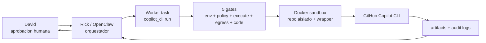

# Rick x Copilot CLI — Vision de autonomia y roadmap

**Fecha:** 2026-05-05
**Owner de vision:** David
**Sistema:** Rick / OpenClaw / Umbral Agent Stack
**Estado:** vision operativa + roadmap; no cambia runtime por si solo.

---

## 1. Resumen ejecutivo

La idea no es "darle una terminal a un agente". La idea es construir una
capacidad controlada para que Rick pueda delegar trabajo tecnico a Copilot CLI,
primero como asistente read-only y despues como ejecutor limitado, trazable y
sandboxeado.

El objetivo final es que Rick pueda coordinar varios agentes y subagentes en
paralelo, cada uno con su propio entorno aislado, para investigar, proponer
patches, correr pruebas controladas y preparar PRs. La diferencia clave es que
cada ejecucion debe quedar auditada, limitada por politicas, con presupuesto y
con rollback. Rick orquesta; Copilot CLI ejecuta tareas acotadas; David conserva
los gates humanos para acciones irreversibles.

En terminos simples:

- Rick decide que trabajo delegar.
- Cada agente recibe una mision concreta.
- Cada mision corre en un sandbox aislado.
- El resultado vuelve como artefacto revisable.
- Nada se mergea, publica, empuja o toca Notion sin permiso explicito.

---

## 2. Por que esto existe

David quiere convertir la capacidad disponible de Copilot/GitHub en produccion
real para Umbral, sin perder control operacional. El riesgo de una integracion
directa es alto: secretos, red, filesystem, `git push`, PRs, gasto, side-effects
en Notion o cambios en produccion.

Por eso se esta construyendo una capa intermedia:



El sistema busca una autonomia progresiva:

1. Primero observar y auditar.
2. Luego permitir lectura y analisis.
3. Luego permitir propuestas de cambio como artefactos.
4. Luego permitir PRs draft bajo reglas.
5. Finalmente permitir trabajo multi-agente paralelo con presupuesto, colas y
   limites.

---

## 3. Vision de producto interno

El producto interno deseado es un "motor de delegacion tecnica" para Rick.

### Caso de uso base

David o Rick piden:

> "Investiga este modulo, encuentra por que fallan estos tests y propone un plan
> de patch."

Rick lo convierte en una mision:

- `mission=research`
- `repo_path=/home/rick/umbral-agent-stack`
- `requested_operations=["read_repo"]`
- presupuesto maximo
- tiempo maximo
- salida esperada

Copilot CLI corre dentro de un contenedor, sin permisos de escritura o con
permisos muy limitados segun fase, y devuelve:

- diagnostico;
- archivos leidos;
- hipotesis;
- patch propuesto como artefacto;
- comandos sugeridos;
- audit log JSONL.

### Caso de uso multi-agente

Rick recibe una tarea mayor:

> "Preparar una migracion segura de X."

Rick la divide:

- Agente A: investiga arquitectura.
- Agente B: revisa tests.
- Agente C: propone patch.
- Agente D: audita riesgos de seguridad.

Cada agente corre con:

- `batch_id`;
- `agent_id`;
- `mission_run_id`;
- workspace propio;
- contenedor propio;
- logs propios;
- limites propios.

Rick integra los resultados y decide si escala a David.

---

## 4. Principios de diseno

1. **Off by default.** Cada gate nace cerrado y debe abrirse de forma explicita.
2. **Una capa no reemplaza otra.** Si L3 esta abierto pero L5 esta cerrado, no
   hay ejecucion real.
3. **Todo side-effect requiere aprobacion.** Especialmente PR merge, push,
   Notion, publish, egress y cambios persistentes.
4. **Auditabilidad antes que velocidad.** Cada run debe dejar evidencia
   verificable.
5. **Rollback simple.** Cada rehearsal debe tener rollback de una linea o un
   cambio pequeno.
6. **Aislamiento por defecto.** Repo, red, secrets y filesystem no se comparten
   libremente entre agentes.
7. **Progreso real, no teatral.** Abrir una branch o lanzar un subagente no es
   avance si no hay resultado integrado.

---

## 5. Gate stack actual

La capacidad se gobierna por cinco capas:

| Layer | Gate | Estado actual esperado | Significado |
|---|---|---:|---|
| L1 | `RICK_COPILOT_CLI_ENABLED` | `true` | La capability puede cargarse en el worker. |
| L2 | `copilot_cli.enabled` | `true` | La politica permite registrar/procesar la task. |
| L3 | `RICK_COPILOT_CLI_EXECUTE` | `false` | No se permite ejecucion real aunque la task exista. |
| L4 | `copilot_cli.egress.activated` | `false` | La red controlada de Copilot no esta activada. |
| L5 | `_REAL_EXECUTION_IMPLEMENTED` | `False` | El codigo no puede lanzar ejecucion real. |

Estado operativo: **deployed but locked**. Rick ya tiene la ruta y la
infraestructura base, pero la ejecucion real sigue bloqueada por L3, L4 y L5.

---

## 6. Lo que ya llevamos

### F1-F6: capability instalada y desplegada

Se diseno e implemento la capability `copilot_cli.run` en el Worker:

- contrato de input/output;
- audit logs JSONL;
- mission contracts;
- agente `rick-tech`;
- envfiles user-scope en `~/.config/openclaw/`;
- token fine-grained PAT v2 cargado en proceso por nombre, sin imprimir valor;
- verifier de entorno y secrets;
- policy config;
- sandbox scaffolding;
- egress design;
- deploy live.

Resultado clave:

- Antes del deploy: `copilot_cli.run` respondia `Unknown task`.
- Despues del deploy: la task existe y responde `capability_disabled/policy_off`.

Eso probo que la capability ya vive en el Worker, pero bloqueada por policy.

### F7 rehearsal 1: policy gate

Se abrio solo L2:

- `copilot_cli.enabled=false -> true`

Resultado:

- La respuesta paso de `policy_off` a `execute_flag_off_dry_run`.
- L3 siguio cerrado.
- No hubo Copilot real.

### F7 rehearsal 2: execute gate temporal

Se abrio temporalmente L3:

- `RICK_COPILOT_CLI_EXECUTE=false -> true`

Resultado:

- La respuesta paso de `execute_flag_off_dry_run` a
  `real_execution_not_implemented`.
- Luego se hizo rollback inmediato a `false`.
- L5 probo ser el bloqueo final de codigo.

### F7 rehearsal 3: readiness de sandbox y egress

Se verifico:

- env/token contract OK;
- Docker accesible;
- scripts de sandbox presentes;
- egress verifier OK;
- resolver dry-run OK;
- sin nft rules aplicadas;
- sin Docker network creada.

### F7 rehearsal 4A: sandbox image

Se construyo la imagen:

- `umbral-sandbox-copilot-cli:6940cf0f274d`

Se valido:

- smoke offline 11/11 PASS;
- wrapper tests 60/60 PASS;
- usuario no-root;
- `cap-drop=ALL`;
- `no-new-privileges`;
- red bloqueada en smoke;
- `/work` read-only;
- deny-list de comandos peligrosos.

### F7 rehearsal 4B: egress staging

Se valido:

- contrato de egress;
- resolver dry-run;
- nft template parse-check con `sudo nft -c`;
- no live apply.

### F7 rehearsal 4C: nft live apply + rollback

Se aplico live la tabla:

- `table inet copilot_egress`

Luego se hizo rollback:

- `sudo nft delete table inet copilot_egress`

Resultado:

- apply OK;
- worker sano;
- task siguio bloqueada por L3;
- rollback limpio;
- no queda tabla nft de Copilot.

### F7 5A: preparado, no activado

Existe branch preparada:

- `rick/copilot-cli-f7-code-gate-rehearsal`
- commit `0d6ad83`

Objetivo de esa branch:

- cambiar `_REAL_EXECUTION_IMPLEMENTED = True`;
- mantener L3 cerrado;
- preparar el siguiente rehearsal de codigo.

Importante: esto esta **preparado**, pero no debe tratarse como activado hasta
que este mergeado, desplegado y verificado en live.

---

## 7. Por que usar PRs y merges aunque el agente pueda hacerlo

Hay dos razones distintas:

### 1. Gobernanza

Los PRs crean un checkpoint visible:

- CI corre;
- el diff queda revisable;
- GitHub conserva el historial;
- se puede revertir;
- David ve exactamente que gate se esta tocando.

Para cambios de runtime o gates, esto importa mas que la comodidad. Un agente
puede ejecutar comandos rapido, pero no debe saltarse el control humano cuando
el cambio acerca el sistema a ejecucion real.

### 2. Trazabilidad operacional

Cada PR responde:

- que se cambio;
- quien lo pidio;
- que evidencia existe;
- que gate se abrio;
- que gate sigue cerrado;
- como se revierte.

En docs-only o evidence-only, el agente puede abrir/mergear si David lo autoriza.
En gates de ejecucion, red o codigo real, el merge debe seguir siendo una
decision explicita.

---

## 8. Lo que todavia NO esta listo

Aunque la base esta muy avanzada, todavia no estamos en autonomia multi-agente.

No esta listo:

- ejecucion real de Copilot CLI;
- L3 persistente en `true`;
- L4 egress activado de forma persistente;
- L5 en `True` desplegado live;
- Docker network final con egress poblado;
- runs concurrentes;
- workspaces por agente;
- presupuestos diarios;
- colas por prioridad;
- PR draft automatico desde resultados;
- merge automatico;
- publicacion o escritura en Notion desde Copilot.

La frase correcta hoy:

> Rick tiene la infraestructura para delegar hacia Copilot CLI, pero la
> ejecucion real sigue bloqueada. Hemos probado cada gate y cada rollback antes
> de permitir el primer run real.

---

## 9. Roadmap propuesto

### F7.5 — Primer run controlado de codigo

Objetivo: probar que el codigo puede llegar al punto de lanzar el sandbox sin
abrir autonomia amplia.

Pasos:

1. Mergear/deployar F7 5A (`_REAL_EXECUTION_IMPLEMENTED=True`) con L3 todavia
   `false`.
2. Probar que la decision sigue bloqueada por `execute_flag_off_dry_run`.
3. Preparar egress con IP sets poblados.
4. Abrir L3 temporalmente para un solo run.
5. Ejecutar una mision read-only.
6. Recolectar audit/artifacts.
7. Rollback de L3.

Criterio de exito:

- una sola invocacion controlada;
- sin writes;
- sin PR;
- sin Notion;
- sin publish;
- audit completo;
- token no expuesto.

### F8 — Single-agent productive mode

Objetivo: permitir que Rick delegue una tarea tecnica read-only a Copilot CLI.

Misiones iniciales recomendadas:

- `research`: leer repo y explicar un modulo.
- `test_explain`: explicar por que falla un test.
- `plan_patch`: proponer un patch como texto, sin aplicarlo.

Controles:

- max wall time;
- max tokens/costo;
- repo allowlist;
- output artifact-only;
- no writes;
- no `git push`;
- no PR create.

### F9 — Patch proposal mode

Objetivo: permitir que Copilot CLI genere un patch como artefacto, no aplicado
automaticamente.

Flujo:

1. Copilot genera diff en `artifacts/`.
2. Rick valida contra policy.
3. Un agente humano/AI distinto aplica el patch en branch.
4. CI corre.
5. David decide merge.

### F10 — PR draft limited mode

Objetivo: permitir PRs draft bajo reglas estrictas.

Permitido:

- crear branch temporal;
- aplicar patch;
- correr tests allowlisted;
- abrir PR draft.

Prohibido:

- merge;
- push a `main`;
- cambios fuera de allowlist;
- secrets;
- Notion/publish.

### F11 — Multi-agent batch mode

Objetivo: que Rick pueda lanzar varios agentes/subagentes en paralelo.

Componentes:

- `batch_id`;
- `agent_id`;
- `mission_run_id`;
- workspace por agente;
- contenedor por agente;
- cola de jobs;
- limites de concurrencia;
- presupuesto por batch;
- dashboard de estado;
- integrador de resultados.

Ejemplo:

| Agente | Mision | Output |
|---|---|---|
| `rick-tech-a` | investigar arquitectura | reporte |
| `rick-tech-b` | revisar tests | lista de fallas |
| `rick-tech-c` | proponer patch | diff artifact |
| `rick-qa` | auditar riesgos | checklist |

Rick no delega el resultado final: Rick integra y responde a David.

---

## 10. Diseno para agentes y subagentes

Para llegar al modelo multi-agente, cada run debe tener identidad propia.

### Identidad minima por run

```yaml
batch_id: "2026-05-05-copilot-batch-001"
agent_id: "rick-tech-a"
mission_run_id: "uuid"
mission: "research"
repo_path: "/home/rick/umbral-agent-stack"
requested_operations:
  - "read_repo"
limits:
  max_wall_sec: 300
  max_cost_usd: 1.00
  max_files_read: 80
```

### Estructura de salida propuesta

```text
reports/copilot-cli/YYYY-MM/<batch_id>/<agent_id>/<mission_run_id>.jsonl
artifacts/copilot-cli/<batch_id>/<agent_id>/<mission_run_id>/
```

### Reglas de handoff

Cada subagente debe tener:

- owner explicito;
- problema a resolver;
- entregable esperado;
- criterio de aceptacion;
- ETA o checkpoint;
- ruta de retorno a Rick;
- evidencia.

Delegar no es cerrar. Rick sigue siendo responsable de integrar.

---

## 11. Politica de decision humana

David debe aprobar explicitamente:

- abrir L3 de forma persistente;
- activar L4 egress;
- mergear L5 `True`;
- permitir writes;
- permitir PR draft;
- permitir concurrencia;
- subir budgets;
- publicar o tocar Notion.

El agente puede ejecutar sin pedir permiso cada vez:

- lectura de estado;
- verificacion de CI;
- docs/evidence PRs, si David ya autorizo esa clase de accion;
- probes read-only;
- secret scans;
- health checks;
- preparar PRs draft para revision.

---

## 12. Primer uso productivo recomendado

No empezar con "arregla todo". Empezar con una mision pequena:

> "Lee `worker/tasks/copilot_cli.py` y explica cuales son los 3 riesgos mas
> probables antes de permitir writes."

Configuracion:

- una sola ejecucion;
- `mission=research`;
- repo allowlisted;
- sin writes;
- sin PR;
- L3 temporal;
- egress controlado;
- rollback inmediato;
- audit review.

Si eso sale limpio, pasar a:

> "Propone un patch como artifact, pero no lo apliques."

---

## 13. Estado actual en una frase

Rick ya tiene una pista de aterrizaje para delegar a Copilot CLI. La pista esta
construida, los frenos fueron probados, el firewall fue probado, el sandbox fue
probado, y el sistema sigue bloqueado antes de ejecucion real. El siguiente hito
es permitir un primer run controlado, no abrir autonomia general.

---

## 14. Siguiente paso recomendado

Siguiente paso tecnico:

1. Revisar/mergear F7 5A si David aprueba abrir el code gate.
2. Desplegarlo en live con L3 todavia `false`.
3. Confirmar que el probe sigue bloqueado por L3.
4. Preparar un rehearsal de primer run read-only con rollback.

Siguiente paso de producto:

1. Definir las primeras 3 misiones productivas para Rick.
2. Definir presupuesto maximo por run y por dia.
3. Definir cuantas ejecuciones paralelas se permiten al inicio.
4. Definir formato de artefacto que David quiere revisar.

No avanzar a autonomia multi-agente hasta tener un primer run single-agent
limpio, barato, auditado y reversible.
