# Publicaciones — Schema v2 (gates visuales + limpieza)

> **Estado:** DISEÑO APROBADO PARA IMPLEMENTAR EN NOTION  
> **DB:** `📰 Publicaciones` · ID `e6817ec4698a4f0fbbc8fedcf4e52472`  
> **Flujo canónico:** `docs/editorial-pipeline/production-flow-v2-2026-06-06.md`  
> **Fecha:** 2026-06-06

---

## 1. Decisión: orden de trabajo

**Primero agregar columnas nuevas → usar en soak → limpiar al final.**

| Fase | Qué | Por qué |
|------|-----|---------|
| **A — Ahora** | Crear columnas de imagen + vista HITL | Desbloquea CAND-001 y automatización sin romper registros |
| **B — Soak** | Rick rellena URLs; David usa desplegable | Valida contrato antes de borrar nada |
| **C — Después** | Ocultar/renombrar/merge duplicados | Requiere migrar datos y actualizar vistas; riesgo bajo si se hace con calma |

No borrar columnas en Fase A. En Notion, ocultar ≠ eliminar.

---

## 2. Modelo escalable de selección de imagen

### Principio

- **Un solo desplegable humano** (`Selección imagen`) con opciones fijas hasta 5 alternativas.
- **URLs por alternativa** en columnas separadas (legibles por Worker/Poller sin parsear el body).
- **Estado de máquina** para Rick/Worker (`Estado imagen`).
- **URL canónica de publicación** en `Visual asset URL` (copiada automáticamente al elegir).

```mermaid
flowchart LR
  G1["aprobado_contenido = true"] --> GEN["Rick: Magnific N alts"]
  GEN --> FILL["Rick: imagen_alt_*_url + imagen_cantidad"]
  FILL --> READY["Estado imagen = Listo para selección"]
  READY --> SEL["David: Selección imagen = Alt N"]
  SEL --> COPY["Worker: Visual asset URL = imagen_alt_N_url"]
  COPY --> G2["autorizar_publicacion = true"]
  G2 --> TG["Telegram: ok publica"]
```



### Columnas nuevas (Fase A)

| Propiedad | Tipo | Opciones / default | Quién escribe | Rol |
|-----------|------|-------------------|---------------|-----|
| `Selección imagen` | Select | Ver §2.1 | **David** | Gate humano entre texto e imagen final |
| `Estado imagen` | Select | Ver §2.2 | Rick / Worker | Automatización y vistas |
| `imagen_cantidad` | Number | 0–5 | Rick | Cuántas alts están activas (N real) |
| `imagen_alt_1_url` | URL | — | Rick | URL final alt 1 (Magnific/CDN) |
| `imagen_alt_2_url` | URL | — | Rick | URL final alt 2 |
| `imagen_alt_3_url` | URL | — | Rick | URL final alt 3 |
| `imagen_alt_4_url` | URL | — | Rick | URL final alt 4 (reserva) |
| `imagen_alt_5_url` | URL | — | Rick | URL final alt 5 (reserva) |
| `imagen_generada_at` | Date | — | Rick / auto | Timestamp última generación |
| `imagen_error` | Rich text | — | Rick / Worker | Último error Magnific (si aplica) |

**Existente, reutilizar:** `Visual brief`, `Visual asset URL` (URL **seleccionada** para publish).

#### §2.1 Opciones `Selección imagen`

| Opción | Color sugerido | Significado |
|--------|----------------|-------------|
| `Pendiente` | gray (default) | Sin elección; o imágenes aún no listas |
| `Alt 1` | blue | David elige alternativa 1 |
| `Alt 2` | blue | David elige alternativa 2 |
| `Alt 3` | blue | David elige alternativa 3 |
| `Alt 4` | purple | Reserva (cuando `imagen_cantidad` ≥ 4) |
| `Alt 5` | purple | Reserva (cuando `imagen_cantidad` ≥ 5) |
| `Regenerar` | orange | Pedir nuevas variantes (Rick resetea pipeline visual) |
| `Sin imagen` | yellow | Publicar sin hero (excepción explícita) |

#### §2.2 Opciones `Estado imagen`

| Opción | Quién la pone | Significado |
|--------|---------------|-------------|
| `No aplica` | default | Gate 1 no pasado; sin brief visual |
| `Pendiente generación` | Worker/Rick tras Gate 1 | Esperando Magnific |
| `Generando` | Rick | `images_generate` en curso |
| `Listo para selección` | Rick | URLs en columnas; David puede elegir |
| `Seleccionada` | Worker | `Visual asset URL` ya copiada |
| `Regeneración pedida` | Worker | David eligió `Regenerar` |
| `Error` | Rick/Worker | Ver `imagen_error` |

### Reglas de automatización (invariantes)

1. Rick **nunca** marca `Selección imagen` ni `autorizar_publicacion`.
2. `autorizar_publicacion = true` solo si:
   - `aprobado_contenido = true`
   - `Selección imagen` ∈ {`Alt 1`…`Alt 5`, `Sin imagen`}
   - `Estado imagen` = `Seleccionada` (o `Sin imagen` con `Visual asset URL` vacío permitido)
3. Al cambiar `Selección imagen` a `Alt N`, Worker copia `imagen_alt_N_url` → `Visual asset URL` y pone `Estado imagen` = `Seleccionada`.
4. Al elegir `Regenerar` desde `Listo para selección` o `Error`: Worker pone `Estado imagen` = `Regeneración pedida`, `Selección imagen` = `Pendiente` y encola la generación. Conserva `imagen_alt_*_url` hasta completar las 5 alternativas nuevas; sólo un éxito 5/5 reemplaza el conjunto completo. `Seleccionada` y `Generando` no se interrumpen.
5. Body de página (`Imágenes candidatas`): **preview humano**; la verdad para publish son las columnas URL.

### Mapeo CAND-001 (migración manual one-off)

Tras Fase A, en la fila CAND-001:

1. Pegar las 3 URLs Magnific en `imagen_alt_1_url`, `imagen_alt_2_url`, `imagen_alt_3_url`.
2. `imagen_cantidad` = 3.
3. `Estado imagen` = `Listo para selección`.
4. David elige en `Selección imagen` → Worker copia a `Visual asset URL`.

---

## 3. Auditoría de columnas actuales (45 props)

### Mantener visibles (operación diaria)

| Grupo | Propiedades |
|-------|-------------|
| Identidad | `Título`, `publication_id`, `Canal`, `Tipo de contenido`, `Estado` |
| Editorial | `Premisa`, `Claim principal`, `Ángulo editorial`, `Copy LinkedIn`, `Copy Blog`, `Copy X`, `Copy Newsletter` |
| Fuentes | `Fuente primaria`, `Fuente referente`, `Fuentes confiables`, `Resumen fuente` |
| Gates v2 | `aprobado_contenido`, `autorizar_publicacion` |
| Visual v2 | `Selección imagen`, `Estado imagen`, `imagen_cantidad`, `imagen_alt_*_url`, `Visual brief`, `Visual asset URL` |
| Publish | `content_hash`, `idempotency_key`, `trace_id`, `platform_post_id`, `publication_url`, `Fecha publicación`, `publish_error`, `error_kind` |
| Ops | `Prioridad`, `Repo reference`, `Proyecto` |

### Ocultar en vistas (Fase C — no borrar aún)

| Propiedad | Motivo |
|-----------|--------|
| `gate_invalidado` | v2: editar texto **no** invalida gates; deprecar lógica |
| `canal_publicado` | Solapa con tracking multicanal futuro; confuso en v1 |
| `published_url` | **Duplicado** de `publication_url` |
| `published_at` | **Duplicado** de `Fecha publicación` |
| `Creado por sistema` | Metadata redundante |
| `Responsable revisión` | Siempre David en v1 |
| `Comentarios revisión` | Preferir comentarios nativos de Notion |
| `Última revisión humana` | Redundante si se usan fechas de gate (futuro) |
| `visual_hitl_required` | Cubierto por flujo Magnific + selección humana |
| `Publicación padre` | Solo si no usan variantes hijas aún |

### Renombrar (Fase C, opcional)

| Actual | Propuesto | Nota |
|--------|-----------|------|
| `aprobado_contenido` | `Texto aprobado` | Solo si se actualiza código Worker (`gates.py`, `publish_guard.py`) |
| `autorizar_publicacion` | `Autorizar publicación` | Ya legible; mantener API name estable |

### Consolidación de duplicados (Fase C)

1. Copiar valores `published_url` → `publication_url` donde falte.
2. Copiar `published_at` → `Fecha publicación` donde falte.
3. Ocultar `published_url` y `published_at`.
4. Tras 30 días sin uso, eliminar (con backup export CSV).

---

## 4. Vistas recomendadas

| Vista | Tipo | Filtro | Columnas visibles |
|-------|------|--------|-------------------|
| **HITL — Revisión** | Table | `Estado` ≠ Publicado, Descartado | Título, Estado, aprobado_contenido, Selección imagen, autorizar_publicacion |
| **Imágenes pendientes** | Table | `Estado imagen` = Listo para selección | Título, imagen_cantidad, Selección imagen, Visual asset URL |
| **Pipeline** | Board | group `Estado` | (existente) |
| **Errores publish** | Table | `publish_error` not empty | Título, error_kind, publish_error |

---

## 5. Gobernanza de superficies (obligatoria)

| Superficie | Puede hacer | No puede hacer |
|------------|-------------|----------------|
| **Notion AI** | Crear/editar **propiedades**, **opciones Select**, **vistas** (columnas visibles, filtros, orden) | Escribir valores en filas, body de páginas, gates, URLs, fuentes, imágenes |
| **Rick (OpenClaw VPS)** | Magnific, props visuales, Decision Brief en body, `Repo reference`, fuentes (según tipo pieza) | Marcar `aprobado_contenido` ni `autorizar_publicacion` |
| **Worker / scripts (`umbral-agent-stack`)** | Poller, copiar `imagen_alt_N_url` → `Visual asset URL`, idempotencia, publish adapters | Gates humanos |
| **David** | Gates, `Selección imagen`, edición final del texto | — |

> **Regla David (2026-06-06):** si hace falta poblar datos, **Rick o el stack en VPS** — nunca Notion AI manual sobre registros.

### Copy por canal — una sola fuente de verdad

| Guardar en | Contenido |
|------------|-----------|
| **Columnas DB** | `Copy LinkedIn`, `Copy X`, `Copy Blog`, `Copy Newsletter` — **canónico para publish** |
| **Body página** | Decision Brief §1–5 (premisa, fuentes, objetivo). **Sin** duplicar copies completos en §6 |
| **Eliminar del body** | Redacciones largas por canal si ya están en columnas (Rick limpia en migración) |

Publish adapters leen **solo columnas**, no el body.

---

## 6. Prompts para Notion AI (solo esquema)

### Prompt A — Fase A (crear columnas) ✅ ejecutado

```text
En la base de datos "📰 Publicaciones" (ID e6817ec4698a4f0fbbc8fedcf4e52472), agrega estas propiedades nuevas sin eliminar ni renombrar ninguna existente:

1) "Selección imagen" — tipo Select, valor por defecto "Pendiente", opciones exactas en este orden: Pendiente, Alt 1, Alt 2, Alt 3, Alt 4, Alt 5, Regenerar, Sin imagen.

2) "Estado imagen" — tipo Select, valor por defecto "No aplica", opciones: No aplica, Pendiente generación, Generando, Listo para selección, Seleccionada, Regeneración pedida, Error.

3) "imagen_cantidad" — tipo Number, sin valor por defecto.

4) "imagen_alt_1_url", "imagen_alt_2_url", "imagen_alt_3_url", "imagen_alt_4_url", "imagen_alt_5_url" — tipo URL cada una.

5) "imagen_generada_at" — tipo Date.

6) "imagen_error" — tipo Text.

Crea una vista de tabla llamada "HITL — Revisión" con columnas: Título, Estado, aprobado_contenido, Selección imagen, Estado imagen, autorizar_publicacion, Visual asset URL. Orden: Última edición descendente.

Crea una vista "Imágenes pendientes" filtrando Estado imagen = "Listo para selección", mostrando: Título, imagen_cantidad, Selección imagen, imagen_alt_1_url, imagen_alt_2_url, imagen_alt_3_url, Visual asset URL.

No toques registros existentes. No borres propiedades. Al terminar, lista las propiedades nuevas creadas.
```

### Prompt C — Fase C (solo vistas; sin tocar filas)

```text
En "📰 Publicaciones", en todas las vistas relevantes, OCULTA estas columnas (no elimines propiedades, no cambies valores de filas): gate_invalidado, canal_publicado, published_url, published_at, Creado por sistema, Responsable revisión, Comentarios revisión, Última revisión humana, visual_hitl_required.

Lista qué vistas modificaste. No migres datos entre columnas. No edites ningún registro.
```

### Prompt D — Fase C eliminación de columnas (solo tras migración VPS + 30 días)

```text
Solo si David confirmó que la migración VPS de published_url → publication_url ya corrió: elimina las propiedades published_url y published_at de la base. Antes, reporta si alguna fila aún tiene valor único no migrado. No edites valores de filas en este paso.
```

---

## 7. Poblado de datos — Rick (Telegram)

```text
Tarea: backfill CAND-001 en 📰 Publicaciones (page 34b5f443-fb5c-81dd-8338-cb0b46699250). NO marcar aprobado_contenido ni autorizar_publicacion.

1) Magnific: recupera URLs exportables de creaciones SOC0YEmUb8, YVwuf7LWeC, nTUEa7wYQD (creations_get). Si Alt 1 CDN falla (504 pikaso), regenera solo esa alt.

2) Props Notion:
   - imagen_cantidad = 3
   - Estado imagen = "Listo para selección"
   - Selección imagen = "Pendiente"
   - imagen_alt_1_url, imagen_alt_2_url, imagen_alt_3_url = URLs estables
   - imagen_generada_at = hoy
   - imagen_error = texto si Alt 1 sigue rota

3) Decision Brief §3 "Fuentes y confianza" en body (insertar arriba si falta):
   - CAND-001 = opinión operativa, sin fuente primaria externa
   - Repo reference → docs/ops/cand-prod001-* en umbral-agent-stack

4) Props fuentes:
   - Repo reference = URL GitHub al payload/handoff
   - Notas = "claim_type: opinión — sin Fuente primaria externa"

Reporta tabla final de props tocadas. No publiques.
```

---

## 8. Poblado de datos — Copilot VPS (SSH)

Handoff para **Copilot-VPS** (`ssh vps-umbral`). Ejecutar en `/home/rick/umbral-agent-stack` con `NOTION_API_KEY` desde `~/.config/openclaw/env`.

```text
Backfill editorial CAND-001 sin tocar gates humanos.

Contexto:
- DB Publicaciones: e6817ec4698a4f0fbbc8fedcf4e52472
- Page CAND-001: 34b5f443-fb5c-81dd-8338-cb0b46699250
- Magnific creation IDs: SOC0YEmUb8, YVwuf7LWeC, nTUEa7wYQD
- Variante 1 embed falló CDN pikaso 504 — usar creations_get o regenerar

Pasos:
1) source ~/.config/openclaw/env
2) Magnific MCP: creations_get por cada ID → URL exportable
3) PATCH Notion vía worker.notion_client.update_page_properties
4) Patrón: scripts/create_cand003_notion.py (solo update, no create)
5) Insertar "## 3. Fuentes y confianza" en page body si falta
6) NO setear aprobado_contenido ni autorizar_publicacion

Veredicto: CAND001_BACKFILL_OK + tabla props + URLs usadas.
```

Migración de duplicados (`published_url` → `publication_url`): **script VPS**, no Notion AI. Cron futuro: Poller detecta `aprobado_contenido` → tarea `editorial.magnific_generate`.

---

## 9. Contrato Worker (siguiente implementación)

Cuando el Notion Poller detecte:

| Evento | Acción |
|--------|--------|
| `aprobado_contenido` false → true | Encolar generación Magnific si `Estado imagen` = `No aplica` o `Pendiente generación` |
| `Selección imagen` → `Alt N` | `Visual asset URL` = `imagen_alt_N_url`; `Estado imagen` = `Seleccionada` |
| `Selección imagen` → `Regenerar` desde `Listo para selección`/`Error` | Conservar URLs previas + `Estado imagen` = `Regeneración pedida` + `Selección imagen` = `Pendiente` + encolar Rick |
| `autorizar_publicacion` true + gates OK | Notificar Rick/Telegram para confirmación final |

---

## 10. Referencias

- `docs/editorial-pipeline/production-flow-v2-2026-06-06.md`
- `docs/ops/magnific-editorial-setup-2026-06-06.md`
- `docs/audits/2026-05-08-notion-publicaciones-schema-audit.md`
- `scripts/discovery/lib/gates.py` (nombres API actuales: `aprobado_contenido`, `autorizar_publicacion`)
