# PIT-5 — Mission Control v2: plan de implementación (judge dashboard + preview)

- **Status:** PLAN — 2026-06-12. **Sin código en este turno.** Cada fase es un PR/handoff independiente con gate David.
- **Base:** `main` @ `ab1afced87dcededcffe950922cc7fe8d897420c` (`feat(pit): PIT-2b spawn real`, PR #474).
- **Visión:** [product-innovation-tournament-vision-2026-06-09.md](product-innovation-tournament-vision-2026-06-09.md) §3.13 — *"Preview: túnel + Mission Control, NO URL pública"* — y roadmap §5 PIT-5.
- **Scope MC:** [ADR-009](../adr/ADR-009-mission-control-scope.md) (read-only estricto, sin launcher).
- **Contratos PIT:** [pit-vault-layout.md](pit-vault-layout.md) · [pit-kanban-kpi-protocol.md](pit-kanban-kpi-protocol.md) · [kpi-pack.schema.json](../../openclaw/workspace-templates/pit-vault/templates/kpi-pack.schema.json) · [pit_outcome_report.yaml](../../openclaw/workspace-templates/pit-vault/templates/pit_outcome_report.yaml) · [pit-2-runner-protocol.md](pit-2-runner-protocol.md).

Convención de evidencia en este doc: **[E]** = verificado en repo/artefacto; **[I]** = inferencia o supuesto a confirmar (típicamente en VPS, fase P5.0).

---

## 1. Problema de usuario (David)

Hoy, para juzgar un torneo PIT, David tiene que:

1. Abrir SSH a la VPS y navegar `~/umbral-pit-vault/pit/<pit_id>/` a mano (`find`, `cat`). **[E]** — el vault es la única fuente; MC v1 no lo lee.
2. Leer N × M `kpi_pack.json` crudos (3 lanes × 5 iteraciones = 15 archivos en el piloto) para reconstruir fulfillment y validación de hipótesis. **[E]** layout en [pit-vault-layout.md](pit-vault-layout.md) §2.
3. Abrir los HTML de `prototype/` sin servidor: `scp` o `cat` — no hay forma navegable de ver los prototipos. **[E]** — MC v1 no sirve HTML; el contrato exige `PROTOTYPE_URL=<url túnel/Mission Control>` ([pit-kanban-kpi-protocol.md](pit-kanban-kpi-protocol.md) §4) que hoy **nadie puede emitir de verdad**: la URL prometida no existe.

Eso es insuficiente para el rol de **judge de producto**: el judge compara lanes por señal KPI + calidad de hipótesis + prototipo navegable, no por diffs de archivos.

**Objetivo PIT-5:** una sola pantalla (MC v2, vía túnel SSH) donde David:

- ve la lista de torneos PIT del vault,
- compara las N lanes lado a lado (fulfillment última iteración, hipótesis validada/refutada, iteraciones corridas, estado announce),
- abre cada prototipo HTML en el browser local,
- descarga/inspecciona cualquier `kpi_pack.json`,
- y decide winner — **sin abrir SSH interactivo al vault ni pedirle pasos manuales a Copilot-VPS**.

---

## 2. Estado actual

### 2.1 Qué tiene MC v1 vs qué falta para PIT

| Capacidad | MC v1 (repo, **[E]**) | Falta para PIT-5 |
|---|---|---|
| App FastAPI `:8089`, bind `127.0.0.1` | ✅ [app.py](../../mission_control/app.py) | — |
| Auth Bearer `MISSION_CONTROL_TOKEN`, fail-closed 503 | ✅ [auth.py](../../mission_control/auth.py) (`hmac.compare_digest`) | variante para preview en browser (ver P5.3 — un `<a href>`/asset no manda headers) |
| Dashboard HTMX dark, cards con polling 10s | ✅ [index.html](../../mission_control/templates/index.html) | página/tab `/pit` judge dashboard |
| `/tournaments` | ⚠️ **hardcoded D3**: historia estática D3.0–D3.3, `launcher_enabled: false` ([tournaments.py](../../mission_control/routes/tournaments.py)) | namespace nuevo `/pit/*` que lea el vault real (no tocar `/tournaments` D3) |
| Adapters read-only (`openclaw.json`, Redis, quota, evals) | ✅ [adapters/](../../mission_control/adapters/) | adapter nuevo `pit_vault.py` (lectura vault + evidencia runner) |
| Config env-driven | ✅ [config.py](../../mission_control/config.py) | `PIT_VAULT_PATH`, `PIT_EVIDENCE_DIR`, allowlist extensiones preview |
| Tests | ✅ `tests/mission_control/` (auth + adapters) | `test_pit_routes.py`, `test_pit_vault_adapter.py`, tests de path traversal |
| systemd unit | ✅ template [mission-control.service.template](../../infra/systemd/mission-control.service.template) | env nuevas + verificación de deploy real (P5.0/P5.4) |
| Preview HTML de prototipos | ❌ no existe | P5.2/P5.3 completos |

### 2.2 Fuentes de datos PIT disponibles (contratos ya congelados)

| Fuente | Path | Qué aporta al judge | Evidencia |
|---|---|---|---|
| Spec | `pit/<pit_id>/spec/pit_spec.yaml` | título, N lanes, iteraciones, budget, KPIs esperados | **[E]** schema `docs/schemas/pit-spec-v1.schema.json` |
| KPI por iteración | `pit/<pit_id>/lanes/<lane_id>/iterations/<n>/kpi_pack.json` | hipótesis, `kpi_achieved` vs `kpi_expected`, `fulfillment_score`, flags `synthetic` | **[E]** [kpi-pack.schema.json](../../openclaw/workspace-templates/pit-vault/templates/kpi-pack.schema.json) |
| Prototipo | `.../iterations/<n>/prototype/` (html) | artefacto navegable | **[E]** layout §2 |
| Lane result file | `pit/<pit_id>/lanes/<lane_id>/announce.md` (3 líneas literales `PROTOTYPE_URL=`/`KPI_PACK=`/`FULFILLMENT=`) | cierre verificable de lane | **[E]** [pit-2-runner-protocol.md](pit-2-runner-protocol.md) §7.1 |
| Outcome | `pit/<pit_id>/outcome/pit_outcome_report.yaml` | winner, learnings, stuck_log | **[E]** template |
| Evidencia runner | `~/.coord-ag-evidence/pit-run/<pit_id>/run-metrics.json` (`PIT_RUN_*`) | veredicto de ejecución, lanes completas | **[E]** protocolo §7.2 |
| Kanban | `.../lanes/<lane_id>/kanban/board.md` | estado de columnas (9 canónicas) | **[E]** — *no se parsea en MVP; link como texto* |

### 2.3 Supuestos VPS a confirmar en P5.0 (separación repo vs VPS)

| # | Repo dice | Prompt David dice | Verificación P5.0 |
|---|---|---|---|
| 1 | PIT-6 (piloto real) "requiere PIT-2..5" ([process index](pit-process-index.md) §roadmap) | piloto `pit-salud-mental-pilot` **ya corrió** con `PIT_PILOT_OK`, 3 lanes × 5 iter **[I]** | listar vault real + run-metrics |
| 2 | deploy MC "NO se deploya automáticamente" ([README](../../mission_control/README.md)) | MC v1 estado en VPS desconocido **[I]** | `systemctl --user status mission-control` |
| 3 | evidencia runner en `~/.coord-ag-evidence/pit-run/<pit_id>/` | prompt menciona además `~/.coord-ag-evidence/PIT-pilot-salud-mental/` **[I]** | inventariar ambos paths |
| 4 | spec ejemplo `examples/pit-salud-mental-pilot.yaml` (N=3, iter=5, 200 USD) **[E]** | el spec del vault debería coincidir **[I]** | diff spec vault vs repo |

### 2.4 Riesgos ADR-009 y cómo el plan los respeta

| Decisión ADR-009 | Riesgo si PIT-5 la viola | Mitigación en este plan |
|---|---|---|
| **D1 read-only** | MC que escribe vault o lanza torneos = launcher encubierto | Todas las rutas `/pit/*` son `GET`; el adapter abre archivos solo lectura; **cero** writes al vault; spawn sigue EXCLUSIVO de `pit_tournament_run.sh` + gate `ok, arranca` |
| **D1 no-launcher sin gate** | botón "re-run lane" en UI | Explícitamente fuera de scope (§5); la UI no tiene acciones, solo lectura y links |
| **D4 token bearer** | preview sin auth = HTML del vault expuesto a cualquier proceso local | preview con URL firmada corta + cookie `HttpOnly` path-scoped (P5.3); JSON sigue bearer-only |
| **D5 sin DB nueva** | indexar torneos en SQLite | lectura directa de filesystem por request (volúmenes chicos: decenas de archivos); sin cache persistente |
| **D6 quality gate** | construir v2 sin uso probado de v1 | P5.0 verifica si MC v1 está deployado/usado; si MC v1 **ni siquiera está corriendo** en VPS, P5.4 lo deploya junto con v2 y el gate D6 (≥2 vistas/día × 3 días) aplica al conjunto |
| Bind `127.0.0.1` + túnel | URL pública | nada cambia el bind; runbook documenta SOLO túnel SSH; checklist PIT-7 ya audita "¿alguna URL pública creada? (debe ser cero)" **[E]** |

> **Nota ADR:** las rutas `/pit/*` siguen dentro del espíritu D1 ("dashboard read-only") pero amplían superficie respecto del MVP congelado. El PR de P5.1 agrega un addendum corto a ADR-009 (sección "Addendum 2026-06: PIT read-only routes") en lugar de abrir una ADR nueva — mismo scope, misma postura, solo fuentes de datos nuevas.

---

## 3. Arquitectura objetivo

```mermaid
flowchart LR
    subgraph laptop["Laptop David (Windows)"]
        B["Browser<br/>http://127.0.0.1:8089/pit"]
        T["ssh -N -L 8089:127.0.0.1:8089 rick@vps"]
        B --> T
    end

    subgraph vps["VPS (systemd user: mission-control.service)"]
        T -->|"túnel SSH<br/>(NUNCA URL pública)"| MC["Mission Control :8089<br/>bind 127.0.0.1"]

        MC --> R1["/pit/tournaments<br/>(JSON, bearer)"]
        MC --> R2["/pit/tournaments/{pit_id}<br/>(JSON, bearer)"]
        MC --> R3[".../lanes/{lane}/kpi/{iter}<br/>(JSON, bearer)"]
        MC --> R4["/pit/preview/{pit}/{lane}/{iter}/...<br/>(HTML estático, URL firmada + cookie)"]

        R1 & R2 & R3 --> AD["adapters/pit_vault.py<br/>SOLO LECTURA"]
        R4 --> GUARD["path guard:<br/>realpath ⊂ vault/pit + regex ids<br/>+ allowlist extensiones"]
        GUARD --> AD

        AD -->|read| V[("~/umbral-pit-vault/pit/<br/>spec · lanes · iterations ·<br/>kpi_pack.json · prototype/ ·<br/>announce.md · outcome/")]
        AD -->|read| EV[("~/.coord-ag-evidence/pit-run/<br/>run-metrics.json")]
        MC -.->|"read (rutas v1 existentes)"| OC[("~/.openclaw/openclaw.json<br/>quota state · Redis")]
    end

    style V fill:#1a2f1a,stroke:#3fb950
    style EV fill:#1a2f1a,stroke:#3fb950
    style GUARD fill:#3a2a1a,stroke:#d29922
```



Principios:

1. **Fuentes de verdad inmutables para MC:** `umbral-pit-vault` (spec/lanes/outcome), `~/.coord-ag-evidence/pit-run/` (run-metrics), `openclaw.json`/quota (ya en v1). MC nunca escribe ninguna.
2. **Dos planos de auth:** JSON = bearer (igual v1). Preview HTML = URL firmada HMAC de vida corta que setea cookie `HttpOnly` con `Path=/pit/preview/<pit_id>/` — los assets relativos del prototipo cargan sin tocar el token; el JS del prototipo **no puede** llamar a las rutas bearer (no hay cookie válida para ellas y no conoce el token).
3. **Namespace separado `/pit/*`:** el `/tournaments` D3 v1 queda intacto (historia D3.x); cero riesgo de regresión.

---

## 4. Fases de implementación

Cada fase = un PR (o handoff VPS) mergeable/ejecutable de forma independiente, con criterio de aceptación binario.

### Fase P5.0 — Audit + smoke paths (Copilot-VPS, ~1 día)

**Objetivo:** convertir todos los **[I]** de §2.3 en **[E]** antes de codear.

Acciones (read-only, sin tocar vault ni servicios):

1. Estado MC v1: `systemctl --user status mission-control` (¿unit existe? ¿activa?); si existe, `curl -fsS http://127.0.0.1:8089/health`.
2. Token: confirmar `MISSION_CONTROL_TOKEN` presente en `~/.config/openclaw/env` (presencia, **no** imprimir el valor).
3. Inventario del piloto en vault: árbol de `~/umbral-pit-vault/pit/pit-salud-mental-pilot/` — spec, lanes, por lane: `announce.md` sí/no, iteraciones presentes, `kpi_pack.json` por iteración, contenido de `prototype/` (archivos + extensiones + tamaños; detectar si hay HTML multi-archivo con css/js relativos o single-file).
4. Evidencia runner: `run-metrics.json` en `~/.coord-ag-evidence/pit-run/pit-salud-mental-pilot/` + inspección de `~/.coord-ag-evidence/PIT-pilot-salud-mental/` (path alternativo mencionado por David).
5. Verificar túnel: documentar el host/puerto SSH real que David usa (alias `~/.ssh/config` si existe).

**Criterio de aceptación:** reporte en evidencia VPS con: estado unit + health, inventario completo del piloto (conteos por lane), extensiones encontradas en `prototype/` (input directo para la allowlist de P5.3), y diffs detectados repo-vs-VPS. Veredicto `P50_MC_PIT_AUDIT_OK` o `P50_MC_PIT_AUDIT_BLOCKED:<motivo>`.

**Prompt listo para copiar:** §7.1.

---

### Fase P5.1 — API read-only PIT (repo, sin deploy)

**Objetivo:** rutas JSON que exponen el vault al dashboard. Solo lectura, sin UI todavía.

**Archivos a tocar:**

| Archivo | Acción |
|---|---|
| `mission_control/adapters/pit_vault.py` | **nuevo** — listado de torneos (incl. `archive/`), parse spec (YAML), scan lanes/iteraciones, parse `announce.md` (3 líneas literales), lectura `kpi_pack.json`, lectura outcome, lectura `run-metrics.json` best-effort |
| `mission_control/routes/pit.py` | **nuevo** — los 3 endpoints JSON |
| `mission_control/config.py` | `PIT_VAULT_PATH` (default `~/umbral-pit-vault`), `PIT_EVIDENCE_DIR` (default `~/.coord-ag-evidence`) |
| `mission_control/app.py` | `app.include_router(pit.router, dependencies=_auth)` |
| `mission_control/README.md` | tabla endpoints + env vars |
| `docs/adr/ADR-009-mission-control-scope.md` | addendum corto (ver §2.4) |
| `tests/mission_control/test_pit_vault_adapter.py`, `test_pit_routes.py` | **nuevos** — fixture `tmp_path` con vault sintético; **jamás** leen un vault real |

**Endpoints (nombres exactos + shapes):**

`GET /pit/tournaments` — lista desde `pit/*/spec/pit_spec.yaml` + `archive/*/`:

```json
{
  "read_only": true,
  "vault": {"path": "/home/rick/umbral-pit-vault", "available": true},
  "tournaments": [
    {
      "pit_id": "pit-salud-mental-pilot",
      "title": "Micro-herramienta de chequeo de carga mental para equipos AECO",
      "mode": "product",
      "lane_count": 3,
      "iteration_count": 5,
      "budget_usd": 200,
      "status": "judge_pending",
      "lanes_complete": 3,
      "has_outcome": false,
      "archived": false,
      "run_verdict": "PIT_RUN_PASS"
    }
  ]
}
```

Derivación de `status` (función pura, testeada): `archived` (bajo `archive/`) → `closed` (outcome con `winner.lane_id`) → `judge_pending` (≥2 lanes con `announce.md`, sin outcome) → `running` (lanes sin announce completo) → `spec_only`. `run_verdict` viene de `run-metrics.json` si existe (best-effort, `null` si no). **[I]** — propuesta de este plan; se congela en el PR P5.1 con tests.

`GET /pit/tournaments/{pit_id}` — detalle judge:

```json
{
  "pit_id": "pit-salud-mental-pilot",
  "spec": {
    "title": "…", "budget_usd": 200, "iteration_count": 5,
    "kpi_definitions": [
      {"kpi_id": "checkin_completion", "unit": "%", "kpi_expected": 60, "direction": "increase", "weight": 2.0}
    ]
  },
  "lanes": [
    {
      "lane_id": "lane-checkin-minimal",
      "announce_present": true,
      "lane_complete": true,
      "iterations_run": 5,
      "last_iteration": 5,
      "fulfillment_score": 0.78,
      "hypothesis_final": {"variable": "taps hasta completar", "kpi_id": "checkin_completion", "validated": true},
      "kpi_pack_path": "pit/pit-salud-mental-pilot/lanes/lane-checkin-minimal/iterations/5/kpi_pack.json",
      "synthetic_share": 1.0,
      "prototype": {"available": true, "entry": "index.html",
                    "preview_path": "/pit/preview/pit-salud-mental-pilot/lane-checkin-minimal/5/"},
      "announce": {"PROTOTYPE_URL": "…", "KPI_PACK": "…", "FULFILLMENT": "0.78"}
    }
  ],
  "outcome": {"present": false, "winner_lane_id": null, "david_gate": null},
  "evidence": {"run_metrics_present": true, "verdict": "PIT_RUN_PASS"}
}
```

Notas: `fulfillment_score` = el del kpi_pack de la **última iteración** (regla de cierre, [protocolo](pit-kanban-kpi-protocol.md) §3); `synthetic_share` = fracción de KPIs con `synthetic: true` en esa iteración (señal para el judge, §5 del protocolo). En P5.1 `prototype.preview_path` se emite aunque la ruta preview aún no exista (404 hasta P5.3) — el shape queda estable.

`GET /pit/tournaments/{pit_id}/lanes/{lane_id}/kpi/{iteration}` — passthrough del `kpi_pack.json` crudo + meta:

```json
{
  "pit_id": "pit-salud-mental-pilot",
  "lane_id": "lane-checkin-minimal",
  "iteration": 5,
  "path": "pit/…/iterations/5/kpi_pack.json",
  "kpi_pack": { "schema_version": 1, "hypothesis": {"…": "…"}, "kpis": [], "fulfillment_score": 0.78 }
}
```

**Validación de inputs (obligatoria en las 3 rutas):** `pit_id` contra `^[a-z0-9][a-z0-9-]{2,63}$`, `lane_id` contra `^lane-[a-z0-9][a-z0-9-]{1,63}$`, `iteration` int 1–10 — los mismos patterns del [kpi-pack.schema.json](../../openclaw/workspace-templates/pit-vault/templates/kpi-pack.schema.json) **[E]**. Input inválido → 422 sin tocar filesystem. Torneo/lane/iter inexistente → 404. Vault ausente → `{"available": false}` (patrón best-effort de v1).

**Criterio de aceptación:** `WORKER_TOKEN=test python -m pytest tests/mission_control/ -q` verde (incluye: vault sintético completo, vault vacío, vault ausente, announce malformado, kpi_pack inválido JSON, ids maliciosos `../`); `pre-commit` verde; cero writes (test que asserta que el adapter no abre archivos en modo escritura). Sin deploy.

---

### Fase P5.2 — UI judge dashboard HTMX

**Objetivo:** la pantalla con la que David juzga.

**Archivos a tocar:** `mission_control/templates/pit.html` (**nuevo**), `mission_control/app.py` (ruta `GET /pit` que renderiza el template, bearer igual que `/`), link cruzado en `index.html` (tab/anchor "PIT").

**Contenido de `/pit`:**

1. **Lista de torneos** (de `GET /pit/tournaments`): pit_id, título, status badge, lanes completas / total, budget.
2. **Vista torneo** (de `GET /pit/tournaments/{pit_id}`): tabla comparativa **una fila por lane**:

   | Columna | Fuente |
   |---|---|
   | lane_id | scan vault |
   | estado (`complete` / `lane_incomplete`) | announce.md + kpi_pack reproducible |
   | iteraciones corridas | scan iterations |
   | **fulfillment última iter** (número grande, color: ≥0.7 verde / ≥0.4 ámbar / resto rojo) | kpi_pack última iter |
   | hipótesis final + validated (✓/✗/∅) | kpi_pack `hypothesis` |
   | % señal sintética | kpi_pack `kpis[].synthetic` |
   | **[Prototipo ▶]** → abre `/pit/preview/...` en tab nueva | P5.3 |
   | **[kpi_pack ⬇]** por iteración (selector 1..N) | endpoint kpi |

3. **Panel KPI detalle:** al expandir una lane, tabla `kpi_id · unit · expected · achieved · direction · synthetic` de la iteración seleccionada (default: última).
4. **Outcome:** si existe, mostrar winner + `david_gate`; si no, banner "judge pendiente — decidí winner y pedile a Rick el outcome report".

Estética: mismo dark theme/cards de [index.html](../../mission_control/templates/index.html) **[E]**. Refresh: botón manual + `hx-trigger="load"` (el vault no cambia cada 10s; no copiar el polling agresivo de v1).

**Restricciones de seguridad UI:** sin iframes a internet; el template solo referencia HTMX ya usado en v1 y endpoints propios `127.0.0.1`; ningún asset remoto nuevo; links de preview solo a paths bajo `/pit/preview/` (allowlist del vault).

**Criterio de aceptación (UX):** con un vault sintético local (fixture de P5.1 servida en dev), David —o quien simule su flujo— puede: abrir `/pit` → elegir torneo → leer la tabla comparativa de 3 lanes → identificar la lane con mayor fulfillment y su hipótesis **sin ejecutar ni un `find`/`cat` por SSH**. Tests: render del template (200, contiene lane_ids del fixture), y test de que `/pit` exige bearer.

---

### Fase P5.3 — Prototype preview seguro

**Objetivo:** servir los HTML de `pit/<pit_id>/lanes/<lane_id>/iterations/<n>/prototype/` en el browser local de David, sin URL pública y sin romper el modelo de auth.

**Diseño (opción A — recomendada): rutas preview firmadas dentro de MC**

- `GET /pit/tournaments/{pit_id}/lanes/{lane_id}/iterations/{n}/preview-link` (bearer): emite `{"url": "/pit/preview/<pit>/<lane>/<n>/?t=<sig>", "expires_at": "…"}` donde `t = HMAC-SHA256(MISSION_CONTROL_TOKEN, "<pit>/<lane>/<n>:<expiry-epoch>") + expiry`, TTL 15 min. La UI de P5.2 llama esto al click.
- `GET /pit/preview/{pit_id}/{lane_id}/{n}/{path:path}`: primer hit valida `t` (HMAC + expiry) → setea cookie `HttpOnly; SameSite=Strict; Path=/pit/preview/<pit_id>/<lane_id>/<n>/` → redirect a `index.html` (o al único `.html` si no hay index). Hits siguientes (assets relativos css/js/img) validan la cookie.
- **Aislamiento:** la cookie solo viaja a ese prefijo; las rutas JSON siguen bearer-only ⇒ el JS de un prototipo (HTML generado por agentes) **no puede** leer el token (HttpOnly) ni llamar `/agents`, `/quotas`, etc. (sin bearer no hay acceso). Blast radius de un prototipo malicioso = sus propios archivos.

**Guards obligatorios (tests dedicados):**

1. **Path traversal:** construir path → `Path.resolve()`/`realpath` → exigir `is_relative_to(<vault>/pit/<pit_id>/lanes/<lane_id>/iterations/<n>/prototype/)`. Rechaza `..`, encodings (`%2e%2e`), y **symlinks que escapen del vault** (comparación post-realpath). 403.
2. **Regex ids** (mismos de P5.1) antes de tocar filesystem.
3. **Allowlist extensiones:** `.html .htm .css .js .json .png .jpg .jpeg .svg .webp .gif .ico .woff .woff2 .txt .md` (ajustar con el inventario real de P5.0). Resto → 403. Content-Type explícito por extensión; `X-Content-Type-Options: nosniff`.
4. **Sin directory listing**; default `index.html`.
5. Headers en HTML servido: `Content-Security-Policy: default-src 'self'; img-src 'self' data:; style-src 'self' 'unsafe-inline'; script-src 'self' 'unsafe-inline'; connect-src 'self'` + `Referrer-Policy: no-referrer`. (Prototipos v1 son estáticos self-contained **[E]** spec `prototype_output: html`; CSP corta exfiltración a internet.)

**Opción B (fallback documentado, no implementar salvo bloqueo):** mini servidor estático efímero por torneo (`python -m http.server` sobre `prototype/`, bind `127.0.0.1:809X`) + segundo túnel SSH. Ventaja: aislamiento de origen total. Costo: gestión de procesos/puertos fuera de systemd + N túneles — peor operación. Se elige A salvo que P5.0 encuentre prototipos que no funcionen bajo subpath.

**Túnel SSH one-liner para David (Windows, PowerShell) — va al runbook:**

```powershell
ssh -N -L 8089:127.0.0.1:8089 rick@<vps-host>
# dejar abierto; en el browser: http://127.0.0.1:8089/pit
```

**Archivos a tocar:** `mission_control/routes/pit_preview.py` (**nuevo**), `mission_control/auth.py` (helper `make_preview_sig`/`verify_preview_sig`), `app.py` (router preview **sin** dependencia bearer global — auth propia por firma/cookie), tests `test_pit_preview.py` (traversal, symlink escape, firma vencida, firma inválida, extensión prohibida, happy path multi-asset).

**Criterio de aceptación:** sobre fixture sintética, los tests anteriores verdes; manualmente (dev local): abrir los **3 prototipos de la iteración 5** del vault sintético en browser vía `http://127.0.0.1:8089/pit` → click [Prototipo ▶] → render correcto con assets. En VPS real esto se valida en P5.4 con el piloto.

---

### Fase P5.4 — Deploy VPS + runbook (Copilot-VPS)

**Objetivo:** MC v2 corriendo en VPS, piloto visible, runbook para David.

**Acciones:**

1. `cd ~/umbral-agent-stack && git pull --ff-only origin main` (post-merge P5.1–P5.3) + `pip install -e .` si cambió `pyproject.toml` (no debería — FastAPI/jinja2/PyYAML ya están **[E]**).
2. Env en `~/.config/openclaw/env`: agregar `PIT_VAULT_PATH=/home/rick/umbral-pit-vault` (+ `PIT_EVIDENCE_DIR` si difiere del default). **No** rotar `MISSION_CONTROL_TOKEN` salvo pedido de David.
3. systemd: si P5.0 encontró la unit instalada → `systemctl --user daemon-reload && systemctl --user restart mission-control`. Si NO está instalada → instalar desde [template](../../infra/systemd/mission-control.service.template) (esto ES el deploy inicial de MC v1+v2 junto; requiere autorización explícita de David en el prompt).
4. Smoke (bearer desde la propia VPS):
   - `curl -fsS http://127.0.0.1:8089/health` → `ok`
   - `GET /pit/tournaments` → contiene `"pit_id": "pit-salud-mental-pilot"`
   - `GET /pit/tournaments/pit-salud-mental-pilot` → 3 lanes con `fulfillment_score` numérico
   - `preview-link` de la lane 1 iter 5 → seguir la URL firmada con `curl -b cookies` → 200 HTML
5. Escribir runbook **`docs/ops/pit-5-mc-v2-runbook.md`** (PR chico desde Windows con input del smoke): túnel one-liner, URL `/pit`, dónde está el token, troubleshooting (503 = token sin setear; `available:false` = vault path mal), y recordatorio gate D6 (mirar ≥2x/día o congelar).

**Criterio de aceptación:** David, desde su laptop, con SOLO el túnel abierto: ve el piloto en `/pit`, abre los 3 prototipos iter 5, descarga un kpi_pack — **sin SSH interactivo al vault**. Veredicto `P54_MC_V2_DEPLOY_OK` (+ commit hash VPS) o `P54_MC_V2_DEPLOY_BLOCKED:<motivo>`.

---

### Fase P5.5 — Integración Rick (opcional, post-MVP)

**Objetivo:** cerrar el loop announce → judge sin que David tenga que recordar URLs.

- Rick post-torneo escribe en `pit_outcome_report.yaml` → `lanes[].prototype_url` el path MC real (`/pit/preview/<pit>/<lane>/<n>/` — cumple el placeholder *"túnel/Mission Control — nunca pública"* del template **[E]**).
- Mensaje Telegram al cierre de collect: `"Torneo <pit_id> listo para judge — abrí el túnel y entrá a http://127.0.0.1:8089/pit"` — **solo texto guía**; Rick NO abre túneles, NO publica URLs, NO adjunta HTML.
- Tocar: skill [product-innovation-tournament](../../openclaw/workspace-templates/skills/product-innovation-tournament/SKILL.md) §Cierre (1 línea) + prompt de Rick. Gate: igual que todo lo de Rick, PR con revisión David.

Condición de entrada: P5.4 OK + al menos 1 sesión real de judge usando el dashboard (evidencia de uso, espíritu D6/D7 de ADR-009).

---

## 5. Fuera de scope (explícito)

- **URL pública / autopublicación** de prototipos o dashboard — prohibido por visión §3.13 y checklist PIT-7 ("URLs públicas = cero").
- **Edición del vault desde MC** (mover a archive, escribir outcome, marcar winner) — el outcome lo escribe Rick con gate David; MC sigue read-only (ADR-009 D1).
- **Launcher de torneos desde MC** — spawn solo vía `pit_tournament_run.sh` + gate literal `ok, arranca`.
- **PIT-3 budget kill enforcement** — otro PR (stub documentado en [pit-2-runner-protocol.md](pit-2-runner-protocol.md)).
- **Figma embed / `prototype_output: figma`** — fase posterior; v1 es html.
- **Parseo del kanban board.md** a estado estructurado — link plano en v2; parsing si el judge lo pide después.
- **Histórico/DB de torneos** — filesystem directo (ADR-009 D5); `archive/` ya da el histórico.
- **Auth multiusuario / HTTPS** — un solo usuario (David) sobre túnel SSH.

## 6. Orden de ejecución + owners

| Fase | Agente | Estimación | Dependencia | Entregable |
|---|---|---|---|---|
| P5.0 | **Copilot-VPS** | ~1 día | ninguna | evidencia audit + `P50_MC_PIT_AUDIT_OK` |
| P5.1 | **Copilot Windows** (PR) | 1–2 días | soft: P5.0 (shapes reales; contratos ya en repo permiten arrancar en paralelo) | PR API + tests + addendum ADR-009 |
| P5.2 | **Copilot Windows** (PR) | 1 día | P5.1 mergeado | PR template `/pit` |
| P5.3 | **Copilot Windows** (PR) | 1–2 días | P5.1 mergeado; allowlist informada por P5.0 | PR preview + guards + tests |
| P5.4 | **Copilot-VPS** | 0.5 día | P5.1–P5.3 mergeados; autorización David para restart/instalación unit | deploy + smoke + input runbook → `P54_MC_V2_DEPLOY_OK` |
| P5.5 | Copilot Windows + Rick | post-MVP | P5.4 + 1 judge real | PR skill/prompt Rick |

Reglas de superficie ([windows-vps-execution-split](../../.agents/skills/windows-vps-execution-split/SKILL.md)): Copilot Windows = PRs en repo, nunca toca runtime VPS. Copilot-VPS = audit/deploy/smoke, nunca edita código de PR. Cualquier restart de servicio en VPS requiere autorización explícita de David en el prompt. Cursor/Windows pushea `main` **antes** de cualquier prompt VPS (regla handoff).

## 7. Prompts listos para pegar

> Formato heredado de [copilot-handoff-prompts.md](copilot-handoff-prompts.md). Pegar uno por turno. **Cada prompt VPS asume `main` ya pusheado.**

### 7.1 PROMPT P5.0 — Copilot-VPS · audit MC + piloto PIT (read-only)

```text
autorizo P5.0 audit read-only Mission Control + piloto PIT — sin restart, sin writes

Sos Copilot-VPS. Audit READ-ONLY para PIT-5 Mission Control v2.
Plan: docs/ops/pit-5-mission-control-v2-implementation-plan.md (§4 P5.0).
PROHIBIDO: restart de servicios, writes al vault, tocar openclaw.json,
imprimir valores de tokens.

cd ~/umbral-agent-stack && git fetch origin main && git pull --ff-only origin main
git log -1 --oneline

EV=~/.coord-ag-evidence/pit5-p50-audit-$(date +%Y%m%d) && mkdir -p "$EV"

# 1. Estado MC v1
systemctl --user status mission-control --no-pager | tee "$EV/mc-unit.txt" || echo "UNIT_ABSENT" | tee "$EV/mc-unit.txt"
curl -fsS http://127.0.0.1:8089/health | tee "$EV/mc-health.txt" || echo "MC_DOWN" | tee -a "$EV/mc-health.txt"
grep -c '^MISSION_CONTROL_TOKEN=' ~/.config/openclaw/env | tee "$EV/mc-token-present.txt"

# 2. Inventario piloto en vault (NO modificar nada)
find ~/umbral-pit-vault/pit/pit-salud-mental-pilot -type f | sort | tee "$EV/vault-tree.txt"
for lane in ~/umbral-pit-vault/pit/pit-salud-mental-pilot/lanes/*/; do
  echo "== $lane"; test -f "$lane/announce.md" && echo ANNOUNCE_OK || echo ANNOUNCE_MISSING
  ls "$lane"/iterations/*/kpi_pack.json 2>/dev/null | wc -l
done | tee "$EV/lanes-summary.txt"
# Extensiones reales en prototype/ (input para allowlist P5.3):
find ~/umbral-pit-vault/pit/pit-salud-mental-pilot/lanes/*/iterations/*/prototype -type f \
  | sed 's/.*\.//' | sort | uniq -c | tee "$EV/prototype-extensions.txt"

# 3. Evidencia runner (ambos paths candidatos)
ls -la ~/.coord-ag-evidence/pit-run/pit-salud-mental-pilot/ 2>/dev/null | tee "$EV/evidence-pit-run.txt"
ls -la ~/.coord-ag-evidence/PIT-pilot-salud-mental/ 2>/dev/null | tee "$EV/evidence-alt-path.txt"
grep -o 'PIT_RUN_[A-Z_]*' ~/.coord-ag-evidence/pit-run/pit-salud-mental-pilot/run-metrics.json 2>/dev/null | tee "$EV/run-verdict.txt"

# 4. Diff spec vault vs repo
diff ~/umbral-pit-vault/pit/pit-salud-mental-pilot/spec/pit_spec.yaml \
     ~/umbral-agent-stack/examples/pit-salud-mental-pilot.yaml | tee "$EV/spec-diff.txt"

Reportar: tabla "Repo dice / VPS muestra" por cada ítem de §2.3 del plan,
extensiones encontradas en prototype/, y veredicto literal:
P50_MC_PIT_AUDIT_OK  ó  P50_MC_PIT_AUDIT_BLOCKED:<motivo>
```

### 7.2 PROMPT P5.1 — Copilot Windows · PR API read-only PIT

```text
autorizo P5.1 — implementar API read-only PIT en Mission Control (PR, sin deploy)

Sos Copilot (Windows). Implementá la Fase P5.1 EXACTAMENTE como la define
docs/ops/pit-5-mission-control-v2-implementation-plan.md §4 (leela primero,
incluyendo shapes JSON y validaciones).

Reglas duras:
- Solo lectura: el adapter pit_vault.py jamás abre archivos en escritura.
- NO tocar mission_control/routes/tournaments.py (D3 history intacta).
- Regex de pit_id/lane_id idénticos a kpi-pack.schema.json; iteration 1-10;
  input inválido => 422 sin tocar filesystem; ausente => 404;
  vault inexistente => {"available": false} (patrón best-effort v1).
- fulfillment de lane = kpi_pack de la ÚLTIMA iteración (protocolo §3).
- announce.md: parsear las 3 líneas literales PROTOTYPE_URL=/KPI_PACK=/FULFILLMENT=.
- Tests con vault sintético en tmp_path (casos: feliz, vault vacío/ausente,
  announce malformado, kpi_pack JSON inválido, ids maliciosos ../).
- Addendum corto en docs/adr/ADR-009-mission-control-scope.md (PIT routes
  read-only, misma postura D1) + README de mission_control actualizado.
- Branch copilot/pit5-p51-api + PR a main. NO mergear sin revisión David.

Verificar: WORKER_TOKEN=test python -m pytest tests/mission_control/ -q verde
y pre-commit verde. Veredicto: P51_PIT_API_PR_READY + URL del PR.
```

### 7.3 PROMPT P5.2 — Copilot Windows · PR UI judge dashboard

```text
autorizo P5.2 — UI judge dashboard /pit (PR, sin deploy)

Sos Copilot (Windows). Implementá la Fase P5.2 de
docs/ops/pit-5-mission-control-v2-implementation-plan.md §4 (leela primero).
Prerrequisito: P5.1 mergeado en main (verificar con git log).

Reglas duras:
- Template mission_control/templates/pit.html con el dark theme de index.html.
- Tabla comparativa por lane: estado, iteraciones, fulfillment última iter
  (color ≥0.7 verde / ≥0.4 ámbar / rojo), hipótesis final ✓/✗/∅, % sintético,
  link [Prototipo ▶] (target preview P5.3, puede 404 por ahora) y
  [kpi_pack ⬇] por iteración.
- Refresh manual + hx-trigger="load" (NO polling 10s sobre el vault).
- Sin assets remotos nuevos, sin iframes externos, sin botones de acción
  (read-only ADR-009; nada de re-run/launch).
- Ruta GET /pit bearer-protegida; tests: 200 con fixture, 401 sin token,
  render contiene lane_ids del fixture.
- Branch copilot/pit5-p52-ui + PR a main. NO mergear sin revisión David.

Veredicto: P52_PIT_UI_PR_READY + URL del PR + screenshot del render local.
```

### 7.4 PROMPT P5.3 — Copilot Windows · PR preview seguro de prototipos

```text
autorizo P5.3 — preview seguro de prototipos HTML (PR, sin deploy)

Sos Copilot (Windows). Implementá la Fase P5.3 de
docs/ops/pit-5-mission-control-v2-implementation-plan.md §4 (leela primero,
opción A: URL firmada HMAC + cookie HttpOnly path-scoped).
Prerrequisito: P5.1 mergeado. Insumo: extensiones reales reportadas por P5.0.

Reglas duras (seguridad, con test cada una):
1. realpath + is_relative_to(<vault>/pit/<pit>/lanes/<lane>/iterations/<n>/prototype/)
   — rechazar .., %2e%2e, symlinks que escapen del vault => 403.
2. Regex ids antes de tocar filesystem (mismos de P5.1).
3. Allowlist extensiones (plan §P5.3, ajustada por P5.0); resto 403;
   Content-Type explícito + X-Content-Type-Options: nosniff.
4. Sin directory listing; default index.html.
5. CSP en HTML servido (default-src 'self'; sin conexiones externas) +
   Referrer-Policy: no-referrer.
6. Firma: HMAC-SHA256 con MISSION_CONTROL_TOKEN, TTL 15 min; cookie HttpOnly
   SameSite=Strict con Path acotado al prefijo del preview. Las rutas JSON
   siguen bearer-only (la cookie NO da acceso a /agents, /quotas, etc.).
7. NUNCA bind distinto de 127.0.0.1; NUNCA URL pública.

Tests: traversal, symlink escape, firma vencida, firma inválida, extensión
prohibida, happy path con html+css+js relativo.
Branch copilot/pit5-p53-preview + PR a main. NO mergear sin revisión David.

Veredicto: P53_PIT_PREVIEW_PR_READY + URL del PR.
```

### 7.5 PROMPT P5.4 — Copilot-VPS · deploy MC v2 + smoke piloto

```text
autorizo P5.4 deploy Mission Control v2 en VPS — incluye restart de
mission-control.service (autorización explícita) — sin tocar vault ni gateway

Sos Copilot-VPS. Ejecutá la Fase P5.4 de
docs/ops/pit-5-mission-control-v2-implementation-plan.md §4 (leela primero).
Prerrequisito: P5.1+P5.2+P5.3 mergeados en main (verificar git log).
PROHIBIDO: tocar openclaw-gateway, escribir en ~/umbral-pit-vault, rotar tokens.

cd ~/umbral-agent-stack && git pull --ff-only origin main && git log -1 --oneline

# Env (append solo si falta; NO duplicar claves)
grep -q '^PIT_VAULT_PATH=' ~/.config/openclaw/env || \
  echo 'PIT_VAULT_PATH=/home/rick/umbral-pit-vault' >> ~/.config/openclaw/env

# Unit: si P5.0 reportó UNIT_ABSENT, instalar desde
# infra/systemd/mission-control.service.template; si existe, solo restart.
systemctl --user daemon-reload && systemctl --user restart mission-control
systemctl --user status mission-control --no-pager

# Smoke (token desde env, no imprimirlo)
source ~/.config/openclaw/env
curl -fsS http://127.0.0.1:8089/health
curl -fsS -H "Authorization: Bearer $MISSION_CONTROL_TOKEN" \
  http://127.0.0.1:8089/pit/tournaments | jq '.tournaments[].pit_id'
curl -fsS -H "Authorization: Bearer $MISSION_CONTROL_TOKEN" \
  http://127.0.0.1:8089/pit/tournaments/pit-salud-mental-pilot | jq '.lanes[] | {lane_id, fulfillment_score, lane_complete}'
# Preview: pedir preview-link de una lane iter 5 y seguirlo con curl -c/-b cookies => 200 HTML

Guardar todo en ~/.coord-ag-evidence/pit5-p54-deploy-$(date +%Y%m%d)/ y
reportar insumos para docs/ops/pit-5-mc-v2-runbook.md (host del túnel, checks).
Si algo falla: rollback = git checkout al commit previo + restart, reportar.
Veredicto: P54_MC_V2_DEPLOY_OK @ <commit>  ó  P54_MC_V2_DEPLOY_BLOCKED:<motivo>
```

## 8. Criterio de éxito global PIT-5

Secuencia completa que David ejecuta solo (sin Copilot-VPS manual):

```text
1. PowerShell:  ssh -N -L 8089:127.0.0.1:8089 rick@<vps-host>
2. Browser:     http://127.0.0.1:8089/pit          → lista muestra pit-salud-mental-pilot
3. Click torneo → tabla comparativa de las 3 lanes  → fulfillment iter 5 visible y coloreado
4. Expandir lane → KPIs iter 5 (expected vs achieved, flags sintéticos)
5. Click [Prototipo ▶] ×3 → los 3 HTML iter 5 renderizan en tabs locales
6. Click [kpi_pack ⬇] → JSON descargado/inspeccionable
7. David decide winner → se lo dice a Rick (frase gate) → Rick escribe outcome
   (fuera de MC; MC solo lo refleja en el próximo refresh)
```

Si los pasos 1–6 funcionan contra el piloto real en VPS: **PIT-5 done** (la parte MC preview; el broker visual Magnific de PIT-5 va por su propio plan, [pit-visual-magnific.md](pit-visual-magnific.md)). Métrica D6 de ADR-009 aplica: si el dashboard no se usa para el primer judge real, congelar P5.5 y revisar en retro.
