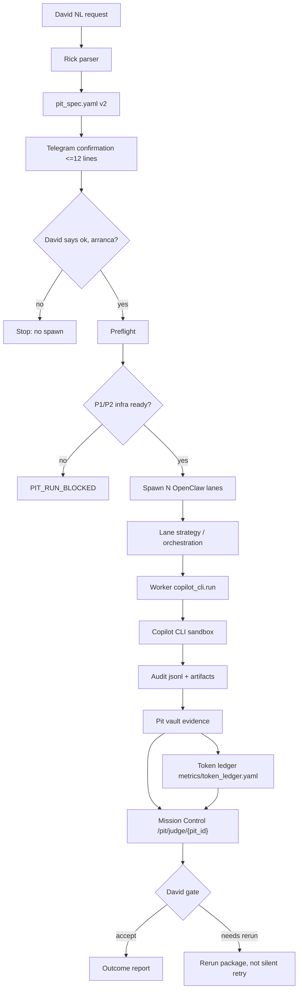

# PIT Tournament v2 — contrato canónico Ruta B broker-real

> **Estado: HISTÓRICO.** Frente PIT archivado por gobernanza (inventario
> `docs/ops/uas-north-inventory-2026-08-06.md` §1 A.2). Este documento es registro de lo que se
> definió — **no es contrato runtime vigente**. La skill `product-innovation-tournament` en
> `main` sigue en su versión previa (v1.3, sin la sección "Contrato canónico v2 — Ruta B
> broker-only"); este contrato nunca se cableó a ella (PKG-UAS-P1-2-KEEP1-ARCHIVE, 2026-08-06).

- **Status:** v2.0 P0 — 2026-06-20.
- **Veredicto documental esperado:** `P0_CONTRACT_OK`.
- **Owner de visión:** David.
- **Orquestación:** Rick / OpenClaw.
- **Broker de coding/repo:** Worker `copilot_cli.run`.
- **Juez:** Mission Control (`/pit/judge/{pit_id}`).
- **Scope de este contrato:** documentación y skill; sin tocar runtime, VPS, `openclaw.json`, Docker, egress, EXECUTE ni torneos reales.

---

## A. North Star — David NL → Rick → broker → judge → gate

La Ruta B existe para convertir una intención natural de David en un torneo PIT
controlado, auditable y ejecutado por broker real.

El flujo canónico es:

1. David expresa el objetivo en lenguaje natural.
2. Rick parsea el pedido y redacta un `pit_spec.yaml` v2.
3. Rick muestra una confirmación corta en Telegram y guarda el detalle en el vault.
4. David habilita el arranque con la frase literal `ok, arranca`.
5. Rick valida preflight, permisos, repo read, allowlist, budget y spec.
6. Rick spawnea N lanes OpenClaw como orquestadoras efímeras.
7. Cada lane decide estrategia, pero no escribe código directo.
8. Cualquier lectura/escritura de repo o coding pasa por Worker `copilot_cli.run`.
9. El Worker ejecuta Copilot CLI en el sandbox permitido para esa lane.
10. El Worker audita cada llamada con `pit_id`, `lane_id`, `batch_id` e `iteration`.
11. Las lanes publican evidencia en el pit-vault.
12. El token ledger consolida sesiones OpenClaw + auditoría Copilot CLI.
13. Mission Control compara lanes en `/pit/judge/{pit_id}`.
14. David revisa el resultado y decide el gate final.

La promesa operacional:

- Rick orquesta.
- Las lanes compiten.
- Copilot CLI implementa.
- Mission Control juzga.
- David decide.

La promesa de seguridad:

- No hay EXECUTE real sin paquete de infraestructura aprobado.
- No hay egress sin red allowlisted.
- No hay secretos por valor en prompts ni logs.
- No hay push al repo producto sin gate humano.
- No hay fallback silencioso a un camino de coding alternativo.

---

## B. Regla de Oro Broker-Only

**Regla:** una lane OpenClaw PIT nunca implementa cambios de repo por sí misma.

OpenClaw lane = orquestador.

Worker `copilot_cli.run` = única superficie de coding/repo.

Esto significa:

- La lane puede leer el `pit_spec.yaml`.
- La lane puede proponer una estrategia.
- La lane puede pedir research permitido.
- La lane puede pedir un batch de trabajo al Worker.
- La lane puede evaluar artefactos producidos por el broker.
- La lane puede escribir evidencia bajo su subárbol del pit-vault.

La lane no puede:

- Ejecutar `git commit`, `git push` o `gh pr create` directamente.
- Modificar un repo producto desde herramientas OpenClaw no broker.
- Llamar `azure-openai-responses` para simular coding si el spec dice `coding_broker: copilot_cli`.
- Usar un fallback mock cuando el broker falla.
- Cambiar modelos para saltarse `lane_models[]`.
- Leer o imprimir secretos por valor.
- Escribir fuera de su scope declarado.

Si `coding_broker: copilot_cli`, todo coding/repo fluye así:

```text
lane -> Rick/OpenClaw parent -> Worker task copilot_cli.run -> Copilot CLI sandbox -> audit -> lane evidence
```

Si `copilot_cli.run` falla:

- La lane marca `lane_status: blocked`.
- El motivo se registra en el vault.
- El torneo puede continuar solo si quedan al menos dos lanes completas.
- No se permite "mock successful implementation".
- No se permite implementar por otra tool para rescatar el resultado.

Esta regla invalida como broker-real cualquier torneo donde las lanes hayan usado
OpenClaw directo para coding/repo en vez de `copilot_cli.run`.

---

## C. Flujo Canónico



ASCII fallback:

```text
David NL
  -> Rick parser
  -> pit_spec.yaml v2
  -> confirmation <=12 lines
  -> "ok, arranca"
  -> preflight gates
  -> N OpenClaw lanes
  -> Worker copilot_cli.run
  -> Copilot CLI sandbox
  -> audit + vault + token ledger
  -> Mission Control judge
  -> David gate
```

---

## D. Gates L1-L5 — Copilot CLI + Infra

La Ruta B avanza por niveles. Saltar un nivel invalida el resultado como
`PIT_RUN_PASS_BROKER_REAL`.

| Gate | Nombre | Permite | Prohíbe | Veredicto mínimo |
|---|---|---|---|---|
| L1 | `dry_run` | Render de plan, payloads, permisos y prompts sin ejecutar Copilot CLI real | EXECUTE, egress, writes | `PIT_RUN_PLAN_ONLY` |
| L2 | execute read-only | `copilot_cli.run` real con lectura de repo y comandos no destructivos permitidos | writes, network egress externo, push | `PIT_RUN_PASS_BROKER_READONLY` |
| L3 | egress allowlisted | Red `copilot-egress` hacia dominios aprobados para Copilot CLI | egress abierto, curl arbitrario, descarga sin allowlist | `PIT_RUN_PASS_BROKER_EGRESS` |
| L4 | write sandbox F9 | Escritura dentro de sandbox por lane, patch/diff reproducible, sin push | tocar repo producto directo, modificar main, filtrar secrets | `PIT_RUN_PASS_BROKER_SANDBOX` |
| L5 | repo product gate | PR o entrega contra repo producto solo tras aprobación explícita David | push/merge automático, release automático | `PIT_RUN_PASS_BROKER_REAL` |

Infra asociada:

- **P1:** imagen Docker `umbral-sandbox-copilot-cli` + red `copilot-egress`.
- **P2:** probe real `copilot_cli.run` read-only con auditoría completa.
- **P3:** verificación de modelos/capacidades/token audit sin inventar slugs.
- **P4:** contrato de schema y validadores.
- **P5:** parser/gates Rick alineados al spec v2.
- **P6:** primer torneo broker-real controlado, sin re-run del torneo #2 antes.

Reglas de gate:

- `EXECUTE=false` implica `DRY_RUN_ONLY`.
- `egress=false` implica que L3-L5 están cerrados.
- `force_default_model:true` bloquea comparabilidad de lanes hasta P3.
- `missions.read_only max_files_touched:0` bloquea cualquier claim de implementación.
- Un resultado visual puede aceptarse como demo, pero no como broker-real.

---

## E. `pit_spec.yaml` v2

`pit_spec.yaml` v2 es el contrato que Rick produce antes del spawn. Debe vivir en
el vault y pasar validación antes de mostrarse a David.

Campos obligatorios:

- `pit_id`
- `prompt`
- `lanes[]`
- `budget_usd`
- `iterations`
- `repo_read`
- `coding_broker`
- `permissions`
- `lane_models[]`

Plantilla canónica:

```yaml
schema_version: 2
pit_id: pit-ejemplo-ruta-b
prompt: >-
  TODO: objetivo redactado por David sin secretos ni credenciales.
budget_usd: 0
iterations: 1

repo_read:
  provider: github
  repo: TODO_OWNER/TODO_REPO
  ref: TODO_BRANCH_OR_SHA
  allowed_paths:
    - docs/
    - examples/
  denied_paths:
    - .env
    - secrets/
    - credentials/
  clone_mode: read_only

coding_broker: copilot_cli

permissions:
  copilot_cli_execute: false
  egress: false
  write_sandbox: false
  repo_product_push: false
  secrets_scope:
    allow_env_refs: []
    allow_mcp: []
    deny:
      - raw_secret_values
      - private_keys
      - personal_tokens
      - browser_sessions
    human_approval: required

lanes:
  - lane_id: lane-a
    lane_goal: TODO
    allowed_paths:
      - docs/
    max_files_touched: 0
  - lane_id: lane-b
    lane_goal: TODO
    allowed_paths:
      - docs/
    max_files_touched: 0

lane_models:
  - lane_id: lane-a
    model_ref: TODO_P3_VPS_VERIFY_MODEL_A
    reasoning_effort: TODO_P3_VPS_VERIFY_ALLOWED_VALUE
  - lane_id: lane-b
    model_ref: TODO_P3_VPS_VERIFY_MODEL_B
    reasoning_effort: TODO_P3_VPS_VERIFY_ALLOWED_VALUE

audit:
  required_metadata:
    - pit_id
    - lane_id
    - batch_id
    - iteration
  token_ledger_path: metrics/token_ledger.yaml

mission_control:
  judge_path: /pit/judge/{pit_id}
  david_gate_required: true
```

Validaciones mínimas:

- `schema_version == 2`.
- `coding_broker == copilot_cli`.
- `budget_usd` viene de David; no hay default silencioso.
- `iterations` viene de David; no hay default silencioso.
- Cada `lane_id` en `lanes[]` tiene entrada en `lane_models[]`.
- `lane_models[].model_ref` usa placeholders hasta P3; no inventar slugs.
- `permissions.copilot_cli_execute` no puede ser `true` antes de P2.
- `permissions.egress` no puede ser `true` antes de P1.
- `permissions.repo_product_push` solo puede ser `true` en L5 con gate David.
- `audit.required_metadata` contiene `pit_id`, `lane_id`, `batch_id`, `iteration`.

Estados derivados:

- Si `copilot_cli_execute=false`: `BROKER_READY: DRY_RUN_ONLY`.
- Si falta `lane_id` o `pit_id` en audit: `PIT_LANE_SPEC_VIOLATION`.
- Si `coding_broker != copilot_cli`: fuera de Ruta B.
- Si una lane usa otro broker: `PIT_LANE_SPEC_VIOLATION`.

---

## F. `secrets_scope` declarativo

Los secretos se declaran por referencia, nunca por valor.

Campos:

```yaml
secrets_scope:
  allow_env_refs:
    - COPILOT_CLI_AUTH_REF
  allow_mcp:
    - github
  deny:
    - raw_secret_values
    - private_keys
    - personal_tokens
    - browser_sessions
    - cookies
    - ssh_keys
  human_approval: required
```

Reglas:

- `allow_env_refs` nombra variables o referencias, no imprime valores.
- `allow_mcp` nombra conectores permitidos por tipo.
- `deny` es siempre aditivo; un deny gana sobre cualquier allow.
- `human_approval: required` es obligatorio cuando una lane pide ampliar scope.
- Un cambio de scope requiere nueva confirmación David.
- Una lane no puede pedir "pegame el token" ni "mostrame el valor".
- El broker debe sanitizar logs antes de volcarlos al vault.

Plantilla de mensaje David → Rick:

```text
Rick, para el PIT <pit_id> autorizo usar estas referencias, sin imprimir valores:
- env refs permitidas: <LISTA>
- MCP permitidos: <LISTA>
- alcance: <lectura/escritura/sandbox>
- expira: <fecha u objetivo>
No autorizo publicar ni copiar valores secretos en prompts, vault, logs ni PRs.
```

Respuesta esperada de Rick:

```text
Confirmado. Uso solo referencias declarativas para <pit_id>.
No voy a imprimir valores secretos.
Si una lane pide más scope, queda blocked hasta nuevo gate David.
```

Red flags:

- El prompt contiene un token literal.
- El log contiene una cookie, key privada o bearer token.
- Una lane pide subir `.env` al vault.
- Un fallback intenta usar credenciales de una sesión local sin scope.
- La auditoría no puede explicar qué referencia usó cada batch.

---

## G. Token Ledger y Budget Kill-Switch

El ledger de tokens es obligatorio para declarar broker-real.

Fuentes:

1. OpenClaw session JSONL.
2. Copilot CLI audit JSONL.
3. Worker `copilot_cli.run` result metadata.
4. Mission Control judge metrics.

Destino canónico:

```text
pit/<pit_id>/metrics/token_ledger.yaml
```

Schema conceptual:

```yaml
pit_id: pit-ejemplo-ruta-b
budget_usd: 0
currency: USD
kill_switch:
  threshold_pct: 100
  status: armed
sources:
  openclaw_session_jsonl:
    path_ref: TODO_RUNTIME_PATH_REF
    includes:
      - lane_id
      - session_id
      - prompt_tokens
      - completion_tokens
  copilot_cli_audit_jsonl:
    path_ref: TODO_RUNTIME_PATH_REF
    includes:
      - pit_id
      - lane_id
      - batch_id
      - iteration
      - model_ref
      - prompt_tokens
      - completion_tokens
entries:
  - lane_id: lane-a
    batch_id: batch-001
    iteration: 1
    source: copilot_cli_audit_jsonl
    model_ref: TODO_P3_VPS_VERIFY_MODEL_A
    prompt_tokens: 0
    completion_tokens: 0
    estimated_cost_usd: 0
totals:
  estimated_cost_usd: 0
  budget_used_pct: 0
  by_lane: []
```

Reglas de ledger:

- Ningún batch sin `pit_id`.
- Ningún batch sin `lane_id`.
- Ningún batch sin `batch_id`.
- Ningún batch sin `iteration`.
- El ledger puede usar `model_ref` placeholder hasta P3.
- El ledger no debe incluir prompt completo si contiene material sensible.
- El ledger debe poder explicar el costo por lane.

Kill-switch:

- Al llegar a 80 %, Rick avisa a David.
- Al llegar a 100 %, Rick bloquea nuevos batches.
- Un override de budget requiere gate David explícito.
- El override queda registrado en el vault.
- Si el ledger no existe, el torneo no puede ser `PIT_RUN_PASS_BROKER_REAL`.

---

## H. Criterios de Veredicto

### `PIT_RUN_PASS`

Usar cuando:

- El torneo completó suficientes lanes según el contrato PIT existente.
- La evidencia de prototipo/KPI/fulfillment es verificable.
- El judge pudo comparar lanes.

No implica por sí solo broker-real.

### `PIT_RUN_PASS_BROKER_REAL`

Usar solo cuando:

- `coding_broker: copilot_cli`.
- Todas las llamadas de coding/repo pasaron por Worker `copilot_cli.run`.
- Auditoría contiene `pit_id`, `lane_id`, `batch_id`, `iteration`.
- `copilot_cli_execute=true` fue habilitado por gate.
- Egress y sandbox cumplen L1-L5.
- Token ledger existe y cuadra con el budget.
- Mission Control judge está disponible.
- David gate final está registrado.

### `ACCEPT_VISUAL_ONLY`

Usar cuando:

- El output visual/prototipo es útil para revisión.
- El judge visual puede aceptarlo como demo.
- No hay evidencia broker-real completa.

Este veredicto es válido para aprendizaje, demo y criterio visual.

Este veredicto no valida Ruta B broker-real.

### `NEEDS_RERUN`

Usar cuando:

- Las lanes usaron una ruta no canónica.
- Faltan campos de auditoría.
- Hubo invalid_input masivo.
- `force_default_model:true` impidió comparar modelos.
- No hay egress/sandbox real cuando el objetivo lo requería.
- No hay token ledger.

Un rerun no es automático. Debe esperar el paquete que cierra la brecha.

### `PIT_LANE_SPEC_VIOLATION`

Usar cuando una lane:

- Implementa fuera de `copilot_cli.run`.
- Toca paths no permitidos.
- Usa modelos no declarados.
- Omite `lane_id` o `pit_id`.
- Imprime secretos.
- Usa fallback mock como si fuera resultado real.
- Escribe en repo producto sin gate.

La violación puede invalidar una lane sin invalidar toda la evidencia visual del
torneo, pero bloquea `PIT_RUN_PASS_BROKER_REAL`.

---

## I. Roadmap P1-P9

| Paquete | Owner | Objetivo | Depende de | Cierra |
|---|---|---|---|---|
| P1 | Copilot-VPS | Construir imagen Docker `umbral-sandbox-copilot-cli` y red `copilot-egress` allowlisted | P0 | `NO_SANDBOX_IMAGE_BUILT`, `NO_EGRESS_NETWORK` |
| P2 | Copilot-VPS | Implementar/probar Worker `copilot_cli.run` read-only real con audit JSONL completo | P1 | `BROKER_READY: DRY_RUN_ONLY`, audit sin metadata |
| P3 | Copilot-VPS + Copilot Windows | Verificar modelos, capacidades, `reasoning_effort`, token audit y slugs reales sin inventar nombres | P2 | `force_default_model:true`, placeholders `TODO_P3_VPS_VERIFY_*` |
| P4 | Codex | Schema v2 + validadores repo-side para `pit_spec.yaml`, `secrets_scope`, ledger y metadata | P0 | `invalid_input reasoning_effort`, specs incompletos |
| P5 | Rick | Parser NL/Telegram v2, confirmación <=12 líneas, gate literal y vault detail | P4 | gaps de UX/gate/spec antes de spawn |
| P6 | Copilot-VPS | Primer run broker-real controlado en modo read-only/egress según gates; sin re-run torneo #2 todavía | P1-P5 | prueba end-to-end de broker real |
| P7 | Comet | Revisión visual/UX comparativa de Mission Control y output de lanes | P6 | aceptación visual separada del broker-real |
| P8 | Rick | Re-run PIT cuando P1-P6 estén verdes y David autorice | P6-P7 | `TORNEO2_INTEGRITY: NEEDS_RERUN` |
| P9 | Codex | Cierre documental post-run: retro, updates a contrato, ledger examples y tasks de hardening | P8 | deuda operativa posterior |

Notas:

- P0 no habilita ejecución.
- P1 no corre torneos.
- P2 no autoriza writes.
- P3 no debe inventar modelos; verifica y reemplaza placeholders.
- P4 puede agregar schemas/tests, pero no toca VPS.
- P5 alinea a Rick, no bypassea gates.
- P6 produce primera evidencia broker-real controlada.
- P8 es el primer punto donde tiene sentido hablar de re-run del torneo #2.
- P9 capitaliza evidencia, no maquilla resultados.

---

## J. Estado Actual — gaps → paquete que los cierra

Fuente: mega-diagnóstico operativo 2026-06-20, resumido sin secrets.

| Gap / hallazgo | Estado actual | Impacto | Paquete cierre |
|---|---|---|---|
| `BROKER_READY` | `DRY_RUN_ONLY` (`EXECUTE=false`, `egress=false`) | No hay broker-real todavía | P1, P2, P6 |
| `TORNEO2_INTEGRITY` | `NEEDS_RERUN` | Torneo #2 no valida Ruta B | P6, P8 |
| Torneo #2 judge | MC OK en `/pit/judge/{pit_id}` | Judge visual funciona | P7 |
| Torneo #2 outcome | `ACCEPT_VISUAL_ONLY` lane-prototype-demo | Válido como demo visual, no como broker-real | P8 |
| `NO_SANDBOX_IMAGE_BUILT` | abierto | Sin sandbox Copilot CLI confiable | P1 |
| `NO_EGRESS_NETWORK` | abierto | Copilot CLI no puede operar con red controlada | P1 |
| `force_default_model:true` | abierto | No hay competencia real de modelos por lane | P3 |
| `missions read-only max_files_touched:0` | abierto | No hay implementación ni write claims | P2, P4 |
| `schema invalid_input reasoning_effort` | abierto | Worker rechaza payloads | P2, P4 |
| audit sin `lane_id`/`pit_id` | abierto | No hay trazabilidad por lane | P2, P4 |
| 82/82 worker calls `invalid_input` | abierto | Probe falló sistémicamente | P2, P4 |
| token ledger incompleto | abierto | Budget y comparabilidad no cerrados | P3, P6 |
| secrets scope no canónico | abierto | Riesgo de prompts/logs inseguros | P4, P5 |

Interpretación:

- El stack de judge ya dio señal útil.
- La evidencia visual del torneo #2 no se descarta.
- La integridad broker-real no está probada.
- La próxima acción no es re-run; es cerrar P1-P6.

---

## K. Mensaje estándar Rick post-torneo #2

Rick debe comunicar el estado sin inflar el resultado:

```text
David, el torneo #2 queda aceptado solo como visual/demo:
veredicto ACCEPT_VISUAL_ONLY.

Mission Control judge funcionó y sirve para comparar lanes.
Pero Ruta B broker-real NO queda validada todavía.

Motivo: las lanes usaron OpenClaw directo, no Worker copilot_cli.run;
además el broker está en DRY_RUN_ONLY (EXECUTE=false, egress=false)
y faltan audit metadata + token ledger completos.

No recomiendo re-run ahora.
Primero cerremos P1-P6:
P1 sandbox+egress, P2 probe copilot_cli.run, P3 modelos/tokens,
P4 schemas, P5 parser/gates Rick, P6 primer broker-real controlado.

Cuando P1-P6 estén verdes, te pido gate para re-run.
```

Versión Telegram ≤12 líneas:

```text
Torneo #2: ACCEPT_VISUAL_ONLY.
El judge MC funcionó.
No valida Ruta B broker-real.
Razón: lanes usaron OpenClaw directo, no copilot_cli.run.
Broker sigue DRY_RUN_ONLY: EXECUTE=false, egress=false.
Faltan audit lane_id/pit_id y token ledger.
No re-run todavía.
Siguiente: P1-P6.
Primero P1 Copilot-VPS: Docker sandbox + copilot-egress.
```

---

## Criterio de salida P0

P0 queda OK cuando este contrato v2, el resumen mega-diagnóstico, el contrato
broker y la skill PIT quedan en PR; la regla broker-only y el roadmap P1-P9
están visibles; no se tocó runtime/VPS; el PR queda sin merge.

Veredicto del paquete: `P0_CONTRACT_OK`
