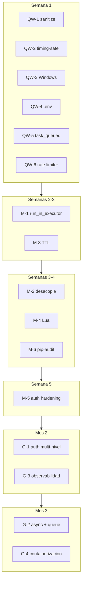

# Plan de implementación — Auditoría Codebase 2026-03

> Auditoría realizada por Claude (PR #101). Este documento planifica **todas** las implementaciones y mejoras derivadas de la auditoría, ordenadas por nivel y dependencias.
>
> Fuentes: `docs/audits/codebase-audit-2026-03/` (01-mapa, 02-bugs, 03-seguridad, 04-mejoras-estructurales, 05-cierre). Si la carpeta aún no está en `main`, consultar el PR #101.

---

## Resumen por nivel

| Nivel | Cantidad | Esfuerzo estimado | Objetivo |
|-------|----------|------------------|----------|
| **Quick Wins (QW)** | 6 | ~1 día | Cerrar P0/P1/P2 y hallazgos SEC de impacto inmediato |
| **Mediano plazo (M)** | 6 | 1–2 semanas | Event loop, TTL, desacople, atomics, auth, pip-audit |
| **Grande (G)** | 4 | 1–2 meses | Auth multi-nivel, worker async + Redis Streams, observabilidad, containerización |

---

## Nivel 1 — Quick Wins (1 día)

### QW-1: Sanitize efectivo + _check_injection defensivo

| Campo | Detalle |
|-------|---------|
| **Bugs / Seguridad** | P0 #3 (02-bugs), SEC-13 (03-seguridad) |
| **Archivos** | `worker/app.py`, `worker/sanitize.py` |
| **Acciones** | 1) En `/run`: `envelope.input = sanitize_input(envelope.input)`. 2) En `/enqueue`: `envelope["input"] = sanitize_input(body.input)` (o equivalente). 3) En `sanitize.py`: que `_check_injection()` lance `ValueError` en lugar de solo loguear. 4) Ajustar tests de sanitize. |
| **Esfuerzo** | 1–2 h |
| **Dependencias** | Ninguna |

---

### QW-2: Comparación timing-safe del token

| Campo | Detalle |
|-------|---------|
| **Bugs / Seguridad** | P1 #9 (02-bugs), SEC-7 (03-seguridad) |
| **Archivos** | `worker/app.py` (~línea 183) |
| **Acciones** | Importar `hmac`. Reemplazar `parts[1] != WORKER_TOKEN` por `not hmac.compare_digest(parts[1], WORKER_TOKEN)`. Verificar tests de auth. |
| **Esfuerzo** | ~15 min |
| **Dependencias** | Ninguna |

---

### QW-3: Validación de inputs en handlers Windows

| Campo | Detalle |
|-------|---------|
| **Bugs / Seguridad** | SEC-10, SEC-11 (Crítico), SEC-12 (Alto) |
| **Archivos** | `worker/tasks/windows.py` |
| **Acciones** | 1) Helper `_validate_safe_name(value, max_len=64)` con regex `[A-Za-z0-9_.-]+`. 2) Aplicar a `name` en `handle_windows_firewall_allow_port`. 3) Aplicar a `username` en `handle_windows_add_interactive_worker_to_startup`. 4) Eliminar `run_as_password` del input HTTP; documentar uso de env var (p. ej. `SCHTASKS_PASSWORD`) en la VM. 5) Tests unitarios para validaciones. |
| **Esfuerzo** | 2–3 h |
| **Dependencias** | Ninguna |

---

### QW-4: Limpiar .env.example y scripts Bitácora

| Campo | Detalle |
|-------|---------|
| **Bugs / Seguridad** | SEC-2, SEC-3 (Alto), SEC-5 (Medio) |
| **Archivos** | `.env.example`, `scripts/add_resumen_amigable.py`, `scripts/enrich_bitacora_pages.py` |
| **Acciones** | 1) Reemplazar IPs Tailscale reales por `<VPS_TAILSCALE_IP>` y `<VM_TAILSCALE_IP>`. 2) Añadir `LINEAR_WEBHOOK_SECRET=` y `NOTION_BITACORA_DB_ID=` con comentarios. 3) En los dos scripts: eliminar default hardcodeado del DB ID; fallar con mensaje claro si no está definido. |
| **Esfuerzo** | ~30 min |
| **Dependencias** | Ninguna |

---

### QW-5: Emitir evento task_queued en ops_log

| Campo | Detalle |
|-------|---------|
| **Bugs / Seguridad** | P1 #5 (02-bugs) |
| **Archivos** | `worker/app.py` (endpoint `/enqueue`), `dispatcher/service.py` (path de retry) |
| **Acciones** | 1) En `worker/app.py` después de `queue.enqueue(envelope)`: llamar `ops_log.task_queued(task_id, body.task, body.team, body.task_type, trace_id)`. 2) En `dispatcher/service.py` después de `queue.enqueue(envelope)` en retry: llamar `ops_log.task_queued(...)` con datos del envelope. 3) Verificar que `scripts/audit_traceability_check.py` detecte el evento. 4) Test unitario que verifique escritura en log. |
| **Esfuerzo** | ~1 h |
| **Dependencias** | Ninguna. `infra/ops_logger.py` ya expone `task_queued()`. |

---

### QW-6: Unificar rate limiter

| Campo | Detalle |
|-------|---------|
| **Bugs / Seguridad** | P2 #13 (02-bugs) |
| **Archivos** | `worker/app.py`, `worker/config.py`, `worker/rate_limiter.py`, `worker/rate_limit.py`, tests |
| **Acciones** | 1) Una sola env: `RATE_LIMIT_RPM`. 2) Eliminar `WORKER_RATE_LIMIT_PER_MIN` de `config.py`. 3) Mantener `rate_limiter.py`; deprecar o eliminar `rate_limit.py`. 4) Migrar tests que usan `rate_limit` a `rate_limiter`. |
| **Esfuerzo** | 1–2 h |
| **Dependencias** | Ninguna |

---

## Nivel 2 — Mediano plazo (1–2 semanas)

### M-1: Handlers en thread pool (run_in_executor)

| Campo | Detalle |
|-------|---------|
| **Bugs / Seguridad** | P0 #1, P0 #2 (02-bugs) |
| **Archivos** | `worker/app.py` |
| **Acciones** | 1) En `/run`: envolver llamada al handler con `await asyncio.get_event_loop().run_in_executor(None, handler, envelope.input)`. 2) En `/enqueue`: igual para llamadas Redis síncronas. 3) Threadpool configurable (uvicorn default o ThreadPoolExecutor). 4) Timeout por handler con `asyncio.wait_for(..., timeout=handler_timeout)`. 5) Test de carga: varias peticiones `llm.generate` concurrentes no bloquean `ping`. |
| **Esfuerzo** | 3–5 días |
| **Dependencias** | Ninguna. Base para G-2. |

---

### M-2: Desacoplar worker de dispatcher (paquete común)

| Campo | Detalle |
|-------|---------|
| **Bugs / Seguridad** | P1 #6 (02-bugs) |
| **Archivos** | Nuevo paquete `shared/` o `common/`, `worker/app.py`, `dispatcher/service.py`, CI/requirements |
| **Acciones** | 1) Crear paquete con `TaskQueue`, `TaskHistory`, `TaskScheduler`, `QuotaTracker`, modelos Pydantic. 2) Mover lógica Redis de `/enqueue`, `/task/history`, `/scheduled`, `/quota/status`, `/providers/status` a ese paquete. 3) En worker y dispatcher importar desde `shared/`. 4) Opcional: `try/except ImportError` y 503 si Redis no disponible. 5) Actualizar CI y requirements. |
| **Esfuerzo** | 3–5 días |
| **Dependencias** | Coordinar con QW-5 si se mueve lógica de enqueue. Base para G-4. |

---

### M-3: Proteger tarea ante TTL expiry en Redis

| Campo | Detalle |
|-------|---------|
| **Bugs / Seguridad** | P0 #4, P1 #12 (02-bugs) |
| **Archivos** | `dispatcher/queue.py`, `infra/ops_logger.py` (evento `task_lost` si hace falta) |
| **Acciones** | 1) En `dequeue()`: si `full_raw is None` tras BRPOP exitoso, loguear `task_lost` en ops_log y no retornar `None` sin trazabilidad. 2) Incluir `callback_url`, `trace_id`, input resumido en el item de `QUEUE_PENDING`. 3) Si el key expiró pero tenemos meta: crear `task_failed` sintético y disparar callback si existe. 4) Métrica/alerta para `task_lost`. 5) Valorar TTL 30 días o PERSIST para tareas activas. |
| **Esfuerzo** | 2–3 días |
| **Dependencias** | QW-5 recomendado antes (trazabilidad). Fix temporal hasta G-2. |

---

### M-4: Operaciones atómicas en Redis (Lua)

| Campo | Detalle |
|-------|---------|
| **Bugs / Seguridad** | P2 #14 (quota), P1 #8 (block_task TOCTOU) |
| **Archivos** | `dispatcher/quota_tracker.py`, `dispatcher/queue.py` |
| **Acciones** | 1) Lua script para `_ensure_window()` en quota_tracker: GET + comparación + SET atómico. 2) Lua script para `block_task()` en queue: LRANGE + LREM atómico. 3) `redis.register_script()`. 4) Tests con fakeredis y concurrencia. 5) Documentar scripts en config/ o infra/. |
| **Esfuerzo** | 2–3 días |
| **Dependencias** | Ninguna. Compatible con G-2 (Redis Streams). |

---

### M-5: Hardening de autenticación y auth logging

| Campo | Detalle |
|-------|---------|
| **Bugs / Seguridad** | SEC-8 (token sin rotación), SEC-9 (sin rate limit en auth), SEC-17 (cabeceras HTTP) |
| **Archivos** | `worker/app.py`, docs (runbook) |
| **Acciones** | 1) Log de auditoría por intento de auth (éxito/fallo) con IP, timestamp, user-agent. 2) Contador de fallos por IP con backoff (bloqueo tras N fallos en 60 s). 3) Documentar rotación de WORKER_TOKEN. 4) Middleware cabeceras: `X-Content-Type-Options: nosniff`, `X-Frame-Options: DENY`. 5) Preparar interfaz para scopes (sin implementar aún). |
| **Esfuerzo** | 3–4 días |
| **Dependencias** | QW-2 antes. Base para G-1. |

---

### M-6: pip-audit en CI y fijar dependencias

| Campo | Detalle |
|-------|---------|
| **Bugs / Seguridad** | P1 #11 (weasyprint en CI), SEC-15 (lock files), SEC-16 (weasyprint libs) |
| **Archivos** | `.github/workflows/`, `worker/requirements.txt`, `dispatcher/requirements.txt`, tests |
| **Acciones** | 1) Generar `requirements.lock` (o pip-tools/uv lock). 2) Step `pip-audit` en CI. 3) En CI: `apt-get install` libcairo2, libpango, libpangocairo, libgdk-pixbuf para weasyprint. 4) Smoke test que importe weasyprint en tests de document_generator. 5) Dependabot o Renovate. |
| **Esfuerzo** | 1–2 días |
| **Dependencias** | Ninguna. Base para G-4. |

---

## Nivel 3 — Grande (1–2 meses)

### G-1: Auth multi-nivel (scopes + rotación)

| Campo | Detalle |
|-------|---------|
| **Bugs / Seguridad** | SEC-1 (token plaintext), SEC-8, SEC-10 |
| **Archivos** | `infra/` (TokenManager, SecretStore), `worker/app.py`, handlers Windows, runbooks |
| **Acciones** | Scopes: `read`, `execute`, `execute:windows`, `admin`. TokenManager con generación, almacenamiento cifrado (SecretStore), validación por scope. Handlers Windows requieren `execute:windows`. Rotación automática (script + distribución). Revocación en Redis. Migrar `handle_windows_write_worker_token`; eliminar password por HTTP. Audit trail: auth_success, auth_failed, token_rotated, token_revoked. Retrocompatibilidad token legacy con deprecation. |
| **Esfuerzo** | 3–4 semanas |
| **Dependencias** | QW-2, QW-3, M-5. |

---

### G-2: Worker async nativo + cola resiliente (Redis Streams)

| Campo | Detalle |
|-------|---------|
| **Bugs / Seguridad** | P0 #1, #2, #4 (02-bugs), R7 in-memory store |
| **Archivos** | `worker/app.py`, handlers, `dispatcher/queue.py`, estado en Redis |
| **Acciones** | Handlers críticos a `async def` con httpx.AsyncClient; sincronos en run_in_executor. Reemplazar `_task_store` por estado en Redis (`umbral:task:{id}`). Queue con Redis Streams (XADD/XREADGROUP), ack explícito, re-delivery. Envelope completo en el stream (evita TTL entre BRPOP y GET). Dead-letter queue y alerta. Métricas queued_at, started_at, completed_at. Misma API HTTP. |
| **Esfuerzo** | 4–6 semanas |
| **Dependencias** | M-1 (paso intermedio). M-3 como parche hasta completar. |

---

### G-3: Observabilidad end-to-end (Langfuse + métricas + alertas)

| Campo | Detalle |
|-------|---------|
| **Bugs / Seguridad** | R5, R9 S6 (01-mapa), P1 #5 |
| **Archivos** | worker, dispatcher, Langfuse, dashboards (Notion/Grafana), scripts |
| **Acciones** | Traces Langfuse: task_queued → model_selected → handler → task_completed/failed. trace_id end-to-end. Dashboard: tasks/hora, latencia p50/p95, tasa fallos, cuota. Alertas: fallos >10%, latencia p95 >60s, quota >90%, worker offline >5 min. Telegram/Notion para quota_exceeded. Evals Langfuse para llm.generate y composite.research_report. Enriquecer governance_metrics_report con Langfuse. |
| **Esfuerzo** | 3–4 semanas |
| **Dependencias** | QW-5, M-1. |

---

### G-4: Despliegue containerizado y CI/CD

| Campo | Detalle |
|-------|---------|
| **Bugs / Seguridad** | R8, R4 (01-mapa), SEC-15, SEC-16 |
| **Archivos** | Dockerfile.worker, Dockerfile.dispatcher, docker-compose, CI/CD, infra/docker/ |
| **Acciones** | Multi-stage Dockerfile worker (con libs weasyprint) y dispatcher (mínimo). Lock files como fuente de verdad. Compose local: worker + dispatcher + Redis + Langfuse. CI/CD: build, push registry, deploy VPS (SSH/Tailscale). Staging aislado. HEALTHCHECK. Secrets vía Docker secrets o env con permisos. |
| **Esfuerzo** | 4–6 semanas |
| **Dependencias** | M-2, M-6. |

---

## Orden de ejecución recomendado

| Fase | Ítems | Notas |
|------|--------|--------|
| **Semana 1** | QW-1 a QW-6 | En paralelo (3 ramas) o secuencial en 1 día. |
| **Semanas 2–3** | M-1, M-3 | P0 más críticos: event loop y pérdida por TTL. |
| **Semanas 3–4** | M-2, M-4, M-6 | Desacople, atomics, pip-audit. |
| **Semana 5** | M-5 | Auth logging y cabeceras. |
| **Mes 2** | G-1, G-3 | En paralelo si hay capacidad. |
| **Mes 3** | G-2, G-4 | Async/queue y containerización. |

---

## Mapas de trazabilidad

### Bugs (02-bugs) → Plan

| Bug | Sev | Plan |
|-----|-----|------|
| #1, #2 | P0 | M-1, G-2 |
| #3 | P0 | QW-1 |
| #4 | P0 | M-3, G-2 |
| #5 | P1 | QW-5, G-3 |
| #6 | P1 | M-2 |
| #7 | P1 | (Notion hijos — ítem aparte si se prioriza) |
| #8 | P1 | M-4 |
| #9 | P1 | QW-2 |
| #10 | P1 | (Notion poll_comments — ítem aparte) |
| #11 | P1 | M-6 |
| #12 | P1 | M-3 |
| #13 | P2 | QW-6 |
| #14 | P2 | M-4 |
| #15 | P2 | (Notion child_database — fix puntual) |
| #16 | P2 | (Auditar model IDs — doc o ítem corto) |
| #17 | P2 | (Filtro /tasks — fix puntual en app.py) |

### Seguridad (03-seguridad) → Plan

| ID | Severidad | Plan |
|----|-----------|------|
| SEC-1 | Crítico | G-1 |
| SEC-2 | Alto | QW-4 |
| SEC-3 | Alto | QW-4 |
| SEC-4 | Alto | (Whitelist en config.py — ítem opcional) |
| SEC-5 | Medio | QW-4 |
| SEC-6 | Bajo | G-1 (SecretStore) |
| SEC-7 | Alto | QW-2 |
| SEC-8 | Medio | M-5, G-1 |
| SEC-9 | Bajo | M-5 |
| SEC-10 | Crítico | QW-3, G-1 |
| SEC-11 | Crítico | QW-3 |
| SEC-12 | Alto | QW-3 |
| SEC-13 | Medio | QW-1 |
| SEC-14 | Medio | (Sanitizar contenido Notion — ítem aparte) |
| SEC-15 | Bajo | M-6, G-4 |
| SEC-16 | Bajo | M-6, G-4 |
| SEC-17 | Medio | M-5 |

---

## Próximo paso: ejecución de Quick Wins

Para ejecutar **solo los Quick Wins (QW-1 a QW-6)** en paralelo con 3 agentes (Codex), ver el plan en tres ramas:

- Rama **worker**: QW-1, QW-2, QW-3, QW-5 (parte worker), QW-6.
- Rama **config**: QW-4.
- Rama **dispatcher**: QW-5 (parte dispatcher).

Detalle de tareas por rama, clones y asignación de modelo (GPT-5.4 en Codex) en el plan «3 branches Codex quick wins» o en `.agents/tasks/` (102, 103, 104).

---

## Otros ítems puntuales (opcionales / seguimiento)

No forman parte de los 16 ítems principales pero aparecen en la auditoría; se pueden abordar cuando haya capacidad:

| Ítem | Origen | Acción sugerida |
|------|--------|------------------|
| Notion: hijos perdidos en prepend | Bug #7 | En `notion_client.py` implementar fetch recursivo de hijos en `_convert_block_for_write` cuando `has_children=True`. |
| Notion: comparación de fechas en poll_comments | Bug #10 | En `poll_comments` parsear fechas con `datetime.fromisoformat()` y añadir paginación por cursor. |
| Notion: no borrar child_database en update_dashboard | Bug #15 | En `update_dashboard_page()` excluir `child_database` del borrado: `b.get("type") not in ("child_page", "child_database")`. |
| Model IDs ficticios | Bug #16 | Auditar `PROVIDER_MODEL_MAP` frente a APIs reales; documentar aliases o actualizar IDs. |
| Filtro /tasks por team incorrecto | Bug #17 | En `GET /tasks` comparar por campo `team` del TaskResult (o añadirlo al modelo), no por subcadena en UUID. |
| config.py sobreescribe todo os.environ | SEC-4 | Filtrar claves permitidas (whitelist) o namespace (UMBRAL_*) en `_load_openclaw_env()`. |
| Contenido Notion sin sanitizar | SEC-14 | Truncar/sanitizar campos textuales antes de enviar a la API Notion en `notion_client.py`. |
